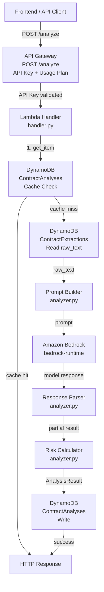
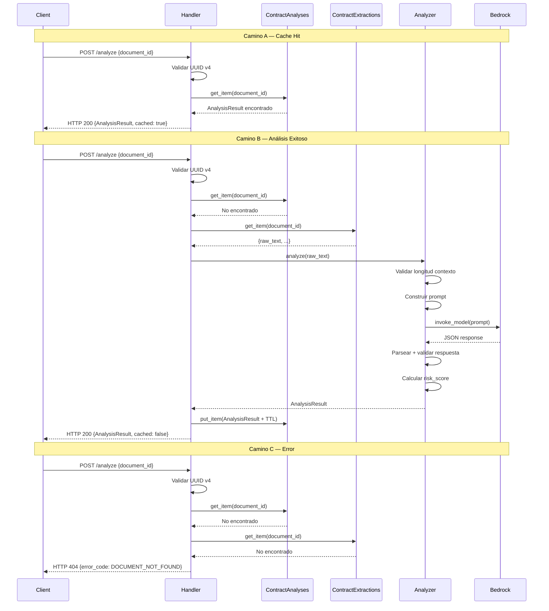

# Design

## Overview

Este diseño describe el Motor de Análisis de Contratos (Módulo 2) de "Claro y Simple". El módulo recibe un `document_id` vía `POST /analyze`, orquesta la invocación a Amazon Bedrock para identificar cláusulas riesgosas, calcula un score de riesgo determinístico, y retorna resultados accionables al frontend.

### Flujo de 10 Pasos

1. **Validar request** — verificar presencia y formato UUID v4 de `document_id`
2. **Buscar cache** — consultar `ContractAnalyses` por resultado previo
3. **Buscar extracción** — si no hay cache, consultar `ContractExtractions` por `raw_text`
4. **Validar contexto** — verificar que `raw_text` no exceda el límite de caracteres
5. **Construir prompt** — cargar template e inyectar `raw_text`
6. **Invocar Bedrock** — llamar al modelo con timeout configurable
7. **Parsear respuesta** — validar JSON contra schema esperado (sin `risk_score`)
8. **Calcular risk_score** — algoritmo determinístico basado en cláusulas
9. **Persistir resultado** — escribir `AnalysisResult` completo en `ContractAnalyses` con TTL 7 días
10. **Retornar respuesta** — HTTP 200 con `AnalysisResult` + `cached: false`

### Decisiones de Diseño Clave

- **risk_score calculado, no generado**: El modelo de IA NO produce `risk_score`. Se calcula determinísticamente para garantizar reproducibilidad y testabilidad.
- **Cache antes de todo**: `ContractAnalyses` (TTL 7 días) se consulta ANTES que `ContractExtractions` (TTL 24h). Esto permite retornar resultados cacheados incluso después de que la extracción expire.
- **Prompt en archivo externo**: El template vive en `prompts/clause_analysis.txt` para iterar sin cambios de código.
- **Excepciones compartidas**: Las nuevas excepciones se agregan a `backend/shared/exceptions.py` (no archivo nuevo).

## Architecture

### Diagrama de Componentes



### Capas del Módulo

| Capa | Archivo | Responsabilidad |
|------|---------|-----------------|
| Entry Point | `handler.py` | Parsea evento API Gateway, orquesta flujo, maneja errores, retorna HTTP response |
| Business Logic | `analyzer.py` | Prompt building, invocación Bedrock, parsing de respuesta, cálculo de risk_score |
| Data Models | `models.py` | Pydantic models (Contrato 2 + Contrato 4), helpers DynamoDB |
| Prompt Template | `prompts/clause_analysis.txt` | Template del prompt en español |
| Shared | `backend/shared/exceptions.py` | Excepciones BedrockError, AnalysisError |
| Shared | `backend/shared/aws_utils.py` | `get_boto3_client` (ya existe) |

## Components and Interfaces

### API Design

**Endpoint**: `POST /analyze`
**Protección**: API Key requerida + Usage Plan (500 req/día) + Throttling (10 req/s, burst 20)

**Request Body**:
```json
{
  "document_id": "string (UUID v4, obligatorio)"
}
```

**Success Response (HTTP 200)**:
```json
{
  "document_id": "uuid",
  "summary_plain": "string",
  "risk_score": 42,
  "clauses": [...],
  "overall_recommendation": "string",
  "cached": false
}
```

**Error Response (HTTP 4xx/5xx)**:
```json
{
  "error_code": "DOCUMENT_NOT_FOUND",
  "message": "El documento solicitado no existe.",
  "document_id": "uuid (opcional)"
}
```

### Diagrama de Secuencia — 3 Caminos



### handler.py — Estructura del Lambda Handler

```python
# Pseudocódigo — estructura del handler

def lambda_handler(event: dict, context: object) -> dict:
    request_id = context.aws_request_id
    logger.append_keys(request_id=request_id)
    document_id: str | None = None

    try:
        # 1. Parsear y validar request
        body = json.loads(event.get("body", "{}"))
        document_id = validate_document_id(body)  # raises AnalysisError

        # 2. Buscar cache en ContractAnalyses
        cached_result = get_cached_analysis(document_id)
        if cached_result:
            return http_response(200, {**cached_result, "cached": True})

        # 3. Buscar extracción en ContractExtractions
        extraction = get_extraction(document_id)  # raises AnalysisError(DOCUMENT_NOT_FOUND)

        # 4-7. Ejecutar análisis (validar contexto, prompt, Bedrock, parse)
        analysis_result = analyze_contract(extraction["raw_text"], document_id)

        # 8. Persistir resultado
        persist_analysis(analysis_result)

        # 9. Retornar respuesta
        return http_response(200, {**analysis_result.model_dump(), "cached": False})

    except AnalysisError as exc:
        # Mapeo error_code → HTTP status
        ...
    except BedrockError as exc:
        # Mapeo específico de errores Bedrock
        ...
    except Exception:
        logger.exception("Error inesperado")
        return http_response(500, {"error_code": "INTERNAL_ERROR", "message": "Error interno."})
```

### analyzer.py — Funciones Principales

```python
def validate_document_id(body: dict) -> str:
    """Valida presencia y formato UUID v4. Raises AnalysisError."""
    ...

def get_cached_analysis(document_id: str) -> dict | None:
    """Consulta ContractAnalyses. Retorna dict si existe, None si no."""
    ...

def get_extraction(document_id: str) -> dict:
    """Consulta ContractExtractions. Raises AnalysisError(DOCUMENT_NOT_FOUND) si no existe."""
    ...

def validate_context_length(raw_text: str) -> None:
    """Verifica que len(raw_text) no exceda MAX_CONTEXT_CHARS. Raises AnalysisError(CONTEXT_TOO_LONG)."""
    ...

def build_prompt(raw_text: str) -> str:
    """Carga template desde prompts/clause_analysis.txt e inyecta raw_text."""
    ...

def invoke_bedrock(prompt: str) -> str:
    """Invoca bedrock-runtime con timeout. Raises BedrockError en fallas."""
    ...

def parse_model_response(raw_response: str) -> ModelResponse:
    """Parsea JSON, valida contra schema. Raises AnalysisError(MODEL_RESPONSE_INVALID)."""
    ...

def calculate_risk_score(clauses: list[Clause]) -> int:
    """Calcula risk_score determinístico (0-100) a partir de clauses."""
    ...

def analyze_contract(raw_text: str, document_id: str) -> AnalysisResult:
    """Orquesta: validar contexto → build prompt → invoke Bedrock → parse → risk_score."""
    ...

def persist_analysis(result: AnalysisResult) -> None:
    """Escribe AnalysisResult en ContractAnalyses con TTL. Raises StorageError(StorageErrorCode.PERSISTENCE_FAILURE)."""
    ...
```

### Risk Calculator — Algoritmo de Cálculo

El `risk_score` se calcula determinísticamente a partir de las cláusulas identificadas:

**Pesos por risk_level:**
| risk_level | Peso |
|------------|------|
| `bajo`     | 10   |
| `medio`    | 25   |
| `alto`     | 45   |

**Fórmula:**
```
raw_score = sum(peso[clause.risk_level] for clause in clauses)
risk_score = min(raw_score, 100)
```

**Comportamiento:**
- 0 cláusulas → `risk_score = 0`
- 1 cláusula `bajo` → `risk_score = 10`
- 2 cláusulas `alto` + 1 `medio` → `risk_score = min(45+45+25, 100) = 100`
- El resultado es siempre un entero en [0, 100], clamped al máximo

**Implementación:**
```python
RISK_WEIGHTS: dict[str, int] = {"bajo": 10, "medio": 25, "alto": 45}

def calculate_risk_score(clauses: list[Clause]) -> int:
    """Calcula risk_score determinístico (0-100) a partir de cláusulas."""
    if not clauses:
        return 0
    raw_score = sum(RISK_WEIGHTS[c.risk_level] for c in clauses)
    return min(raw_score, 100)
```

### Prompt Template — `prompts/clause_analysis.txt`

```text
Eres un asistente legal especializado en analizar contratos en español.
Tu objetivo es identificar cláusulas que puedan ser riesgosas o desfavorables
para la persona que firma el contrato.

Analiza el siguiente contrato y retorna tu respuesta EXCLUSIVAMENTE como un
objeto JSON válido con la siguiente estructura (sin texto adicional fuera del JSON):

{
  "summary_plain": "Resumen del contrato en lenguaje simple y accesible (máximo 500 palabras)",
  "clauses": [
    {
      "clause_text": "Texto original de la cláusula tal como aparece en el contrato",
      "category": "renovacion_automatica | multa | jurisdiccion | cesion_datos | otro",
      "risk_level": "bajo | medio | alto",
      "explanation": "Explicación en lenguaje simple de por qué esta cláusula es riesgosa",
      "suggested_question": "Pregunta que el usuario debería hacer antes de firmar"
    }
  ],
  "overall_recommendation": "Recomendación general sobre el contrato en lenguaje simple"
}

REGLAS IMPORTANTES:
- "category" DEBE ser exactamente uno de: "renovacion_automatica", "multa", "jurisdiccion", "cesion_datos", "otro"
- "risk_level" DEBE ser exactamente uno de: "bajo", "medio", "alto"
- Si no encuentras cláusulas riesgosas, retorna "clauses" como un array vacío []
- Las explicaciones y preguntas sugeridas deben estar en español, usando lenguaje cotidiano
- NO incluyas un campo "risk_score" — ese valor se calcula por separado
- El "summary_plain" debe ser comprensible para alguien sin formación legal

CONTRATO A ANALIZAR:
---
{raw_text}
---

Responde ÚNICAMENTE con el JSON, sin explicaciones adicionales.
```

### Configuración y Variables de Entorno

| Variable | Descripción | Ejemplo |
|----------|-------------|---------|
| `EXTRACTIONS_TABLE_NAME` | Nombre de tabla DynamoDB de extracciones | `ContractExtractions` |
| `ANALYSES_TABLE_NAME` | Nombre de tabla DynamoDB de análisis | `ContractAnalyses` |
| `BEDROCK_MODEL_ID` | Identificador del modelo en Bedrock | Revisar catálogo actual de Bedrock al implementar — no fijar modelo específico |
| `MAX_CONTEXT_CHARS` | Límite máximo de caracteres del raw_text para el prompt (aproximación razonable sin tokenizer) | `150000` |
| `BEDROCK_TIMEOUT_SECONDS` | Timeout para la invocación a Bedrock | `45` |
| `AWS_ENDPOINT_URL` | Endpoint override para LocalStack | `http://localhost:4566` |
| `AWS_REGION` | Región AWS (solo en .env local, no en template.yaml para prod) | `us-east-1` |
| `LOG_LEVEL` | Nivel de logging | `INFO` |

### Consideraciones de Infraestructura SAM

En `infra/template.yaml`, el recurso Lambda del Módulo 2 debe definir:

- **Runtime**: `python3.12`
- **Timeout**: `60` segundos (mayor que `BEDROCK_TIMEOUT_SECONDS` de 45s)
- **MemorySize**: `256` MB (suficiente para Pydantic + prompt processing)
- **Environment Variables**: todas las listadas arriba (excepto `AWS_REGION` en prod)
- **Policies**: permisos para DynamoDB (get/put en ambas tablas) + `bedrock:InvokeModel`
- **Events**: `Api` event con `Auth: ApiKey` para protección
- **Tags**: `project: hackaton`

## Data Models

### `backend/analysis/models.py`

```python
from __future__ import annotations

import time
from enum import Enum
from typing import Literal, Optional

from pydantic import BaseModel, Field


# ============================================================================
# Modelos del Contrato 2 — Resultado de Análisis
# ============================================================================

ClauseCategory = Literal[
    "renovacion_automatica",
    "multa",
    "jurisdiccion",
    "cesion_datos",
    "otro",
]

RiskLevel = Literal["bajo", "medio", "alto"]


class Clause(BaseModel):
    """Una cláusula riesgosa identificada en el contrato."""
    clause_text: str = Field(min_length=1)
    category: ClauseCategory
    risk_level: RiskLevel
    explanation: str
    suggested_question: str


class AnalysisResult(BaseModel):
    """
    Resultado completo del análisis. Implementa el Contrato 2.
    Persistido en DynamoDB tabla ContractAnalyses.
    """
    document_id: str
    summary_plain: str
    risk_score: int = Field(ge=0, le=100)
    clauses: list[Clause] = Field(default_factory=list)
    overall_recommendation: str


# ============================================================================
# Modelo parcial — Respuesta cruda del modelo de IA (sin risk_score)
# ============================================================================


class ModelClause(BaseModel):
    """Cláusula tal como la retorna el modelo (misma estructura que Clause)."""
    clause_text: str = Field(min_length=1)
    category: ClauseCategory
    risk_level: RiskLevel
    explanation: str
    suggested_question: str


class ModelResponse(BaseModel):
    """
    Schema esperado de la respuesta del modelo de IA.
    NO incluye risk_score — ese campo se calcula por Risk_Calculator.
    """
    summary_plain: str
    clauses: list[ModelClause] = Field(default_factory=list)
    overall_recommendation: str


# ============================================================================
# Modelos del Contrato 4 — Respuesta HTTP de POST /analyze
# ============================================================================


class AnalyzeErrorCode(str, Enum):
    """Códigos de error para las respuestas HTTP del endpoint POST /analyze."""
    MISSING_DOCUMENT_ID = "MISSING_DOCUMENT_ID"
    INVALID_DOCUMENT_ID = "INVALID_DOCUMENT_ID"
    DOCUMENT_NOT_FOUND = "DOCUMENT_NOT_FOUND"
    CONTEXT_TOO_LONG = "CONTEXT_TOO_LONG"
    MODEL_RESPONSE_INVALID = "MODEL_RESPONSE_INVALID"
    BEDROCK_TIMEOUT = "BEDROCK_TIMEOUT"
    BEDROCK_THROTTLED = "BEDROCK_THROTTLED"
    BEDROCK_SERVICE_ERROR = "BEDROCK_SERVICE_ERROR"
    PERSISTENCE_FAILURE = "PERSISTENCE_FAILURE"
    INTERNAL_ERROR = "INTERNAL_ERROR"


class AnalyzeSuccessResponse(BaseModel):
    """Respuesta exitosa de POST /analyze (HTTP 200). Contrato 2 + campo cached."""
    document_id: str
    summary_plain: str
    risk_score: int = Field(ge=0, le=100)
    clauses: list[Clause] = Field(default_factory=list)
    overall_recommendation: str
    cached: bool = False


class AnalyzeErrorResponse(BaseModel):
    """Respuesta de error de POST /analyze."""
    error_code: AnalyzeErrorCode
    message: str
    document_id: Optional[str] = None


# ============================================================================
# Helpers de serialización DynamoDB
# ============================================================================


def build_analysis_dynamodb_item(result: AnalysisResult) -> dict:
    """
    Serializa un AnalysisResult a formato DynamoDB AttributeValue.
    Incluye atributo TTL (7 días desde ahora).
    """
    ttl_value = int(time.time()) + 604800  # 7 días

    clauses_list = []
    for clause in result.clauses:
        clauses_list.append({
            "M": {
                "clause_text": {"S": clause.clause_text},
                "category": {"S": clause.category},
                "risk_level": {"S": clause.risk_level},
                "explanation": {"S": clause.explanation},
                "suggested_question": {"S": clause.suggested_question},
            }
        })

    return {
        "document_id": {"S": result.document_id},
        "summary_plain": {"S": result.summary_plain},
        "risk_score": {"N": str(result.risk_score)},
        "clauses": {"L": clauses_list},
        "overall_recommendation": {"S": result.overall_recommendation},
        "ttl": {"N": str(ttl_value)},
    }


def deserialize_analysis_item(item: dict) -> dict:
    """
    Convierte un ítem DynamoDB (formato AttributeValue) a un dict plano
    compatible con AnalysisResult.
    """
    clauses = []
    for clause_attr in item.get("clauses", {}).get("L", []):
        m = clause_attr.get("M", {})
        clauses.append({
            "clause_text": m["clause_text"]["S"],
            "category": m["category"]["S"],
            "risk_level": m["risk_level"]["S"],
            "explanation": m["explanation"]["S"],
            "suggested_question": m["suggested_question"]["S"],
        })

    return {
        "document_id": item["document_id"]["S"],
        "summary_plain": item["summary_plain"]["S"],
        "risk_score": int(item["risk_score"]["N"]),
        "clauses": clauses,
        "overall_recommendation": item["overall_recommendation"]["S"],
    }
```

### Nuevas excepciones en `backend/shared/exceptions.py`

Las siguientes excepciones se agregan al archivo existente (no se crea archivo nuevo):

```python
# ---------------------------------------------------------------------------
# BedrockError — Módulo 2: errores de comunicación con Amazon Bedrock
# ---------------------------------------------------------------------------


class BedrockErrorCode(str, Enum):
    """Códigos de error para fallos de comunicación con Bedrock."""
    BEDROCK_TIMEOUT = "BEDROCK_TIMEOUT"
    BEDROCK_THROTTLED = "BEDROCK_THROTTLED"
    BEDROCK_SERVICE_ERROR = "BEDROCK_SERVICE_ERROR"


class BedrockError(Exception):
    """Raised when Bedrock invocation fails."""

    def __init__(self, error_code: BedrockErrorCode, message: str) -> None:
        self.error_code = error_code
        self.message = message
        super().__init__(message)


# ---------------------------------------------------------------------------
# AnalysisError — Módulo 2: errores de lógica de análisis
# ---------------------------------------------------------------------------


class AnalysisErrorCode(str, Enum):
    """Códigos de error para fallos en el flujo de análisis."""
    MISSING_DOCUMENT_ID = "MISSING_DOCUMENT_ID"
    INVALID_DOCUMENT_ID = "INVALID_DOCUMENT_ID"
    DOCUMENT_NOT_FOUND = "DOCUMENT_NOT_FOUND"
    CONTEXT_TOO_LONG = "CONTEXT_TOO_LONG"
    MODEL_RESPONSE_INVALID = "MODEL_RESPONSE_INVALID"


class AnalysisError(Exception):
    """Raised by analyzer when analysis logic fails."""

    def __init__(self, error_code: AnalysisErrorCode, message: str) -> None:
        self.error_code = error_code
        self.message = message
        super().__init__(message)
```

## Correctness Properties

*Una property es una característica o comportamiento que debe cumplirse en todas las ejecuciones válidas de un sistema — esencialmente, una declaración formal sobre lo que el sistema debe hacer. Las properties sirven como puente entre especificaciones legibles por humanos y garantías de corrección verificables por máquinas.*

### Property 1: Límite acotado del risk score

*Para cualquier* lista de cláusulas (incluyendo listas vacías), donde cada cláusula tiene un `risk_level` válido en `{"bajo", "medio", "alto"}`, la función `calculate_risk_score` SHALL producir un entero en el rango [0, 100] inclusive.

**Validates: Requirements 8.1, 8.4**

### Property 2: Monotonicidad del risk score

*Para cualquier* lista de cláusulas `L` y cualquier cláusula adicional `c` con un `risk_level` válido, el risk score de `L + [c]` SHALL ser mayor o igual al risk score de `L`.

**Validates: Requirements 8.3**

### Property 3: Risk score cero sin cláusulas

*Para cualquier* invocación de `calculate_risk_score` con una lista vacía, el resultado SHALL ser exactamente 0.

**Validates: Requirements 8.2**

### Property 4: Fidelidad del round-trip de caché

*Para cualquier* `AnalysisResult` válido, serializarlo con `build_analysis_dynamodb_item` y luego deserializarlo con `deserialize_analysis_item` SHALL producir un dict cuyos campos (`document_id`, `summary_plain`, `risk_score`, `clauses`, `overall_recommendation`) sean equivalentes al original.

**Validates: Requirements 9.1, 9.2**

### Property 5: Rechazo de respuesta inválida del modelo

*Para cualquier* string que sea (a) JSON inválido, (b) JSON válido pero sin los campos requeridos (`summary_plain`, `clauses`, `overall_recommendation`), o (c) JSON válido con `category` fuera de ClauseCategory o `risk_level` fuera de RiskLevel, la función `parse_model_response` SHALL lanzar un error que resulte en `MODEL_RESPONSE_INVALID`.

**Validates: Requirements 7.1, 7.2, 7.3**

### Property 6: El parseo de respuesta válida preserva los datos

*Para cualquier* string JSON bien formado que conforme al schema de `ModelResponse` (categorías válidas, risk_levels válidos, clause_text no vacío), la función `parse_model_response` SHALL retornar un objeto `ModelResponse` cuyos campos coincidan exactamente con el JSON de entrada.

**Validates: Requirements 7.4**

### Property 7: Rechazo de UUID inválido

*Para cualquier* string que no coincida con el patrón regex UUID v4 `^[0-9a-f]{8}-[0-9a-f]{4}-4[0-9a-f]{3}-[89ab][0-9a-f]{3}-[0-9a-f]{12}$`, la función `validate_document_id` SHALL lanzar un error que resulte en `INVALID_DOCUMENT_ID`.

**Validates: Requirements 1.2**

### Property 8: Seguridad ante errores inesperados

*Para cualquier* excepción inesperada lanzada durante la ejecución del handler, la respuesta HTTP SHALL tener status 500 con `error_code` igual a `INTERNAL_ERROR` y el body de la respuesta SHALL NO contener stack traces, nombres de variables internas, ni detalles de infraestructura.

**Validates: Requirements 14.1, 14.3**

## Error Handling

### Tabla de Mapeo de Errores

| Excepción | error_code | HTTP Status | Se persiste en DynamoDB | Nivel de log |
|-----------|-----------|-------------|------------------------|-------------|
| `AnalysisError(MISSING_DOCUMENT_ID)` | `MISSING_DOCUMENT_ID` | 400 | No | WARNING |
| `AnalysisError(INVALID_DOCUMENT_ID)` | `INVALID_DOCUMENT_ID` | 400 | No | WARNING |
| `AnalysisError(DOCUMENT_NOT_FOUND)` | `DOCUMENT_NOT_FOUND` | 404 | No | WARNING |
| `AnalysisError(CONTEXT_TOO_LONG)` | `CONTEXT_TOO_LONG` | 422 | No | WARNING |
| `AnalysisError(MODEL_RESPONSE_INVALID)` | `MODEL_RESPONSE_INVALID` | 422 | No | ERROR |
| `BedrockError(BEDROCK_TIMEOUT)` | `BEDROCK_TIMEOUT` | 503 | No | ERROR |
| `BedrockError(BEDROCK_THROTTLED)` | `BEDROCK_THROTTLED` | 503 | No | WARNING |
| `BedrockError(BEDROCK_SERVICE_ERROR)` | `BEDROCK_SERVICE_ERROR` | 502 | No | ERROR |
| `StorageError(PERSISTENCE_FAILURE)` | `PERSISTENCE_FAILURE` | 502 | No (la falla ES la escritura) | ERROR |
| `Exception` (no manejada) | `INTERNAL_ERROR` | 500 | No | ERROR (con traceback) |

### Reglas de Manejo

1. **Todas las respuestas de error** incluyen `Content-Type: application/json`, `error_code`, y `message` no vacío.
2. **`document_id` en error responses**: se incluye siempre que el request contenía un UUID v4 válido (incluso si el documento no existe).
3. **No exponer internals**: los mensajes de error para el cliente son genéricos e informativos, nunca incluyen stack traces, nombres de variables, o detalles de infraestructura.
4. **Logging completo internamente**: el traceback completo se loguea con nivel ERROR para debugging en CloudWatch.
5. **`raw_text` nunca en logs**: para proteger datos personales del contrato, el contenido de `raw_text` no se incluye en ningún log entry.

### Mapeo de Excepciones boto3 de Bedrock

```python
# En invoke_bedrock():
from botocore.exceptions import ClientError, ReadTimeoutError

try:
    response = bedrock_client.invoke_model(...)
except ReadTimeoutError:
    raise BedrockError(BedrockErrorCode.BEDROCK_TIMEOUT, "Bedrock no respondió a tiempo.")
except ClientError as e:
    code = e.response["Error"]["Code"]
    if code == "ThrottlingException":
        raise BedrockError(BedrockErrorCode.BEDROCK_THROTTLED, "Bedrock rechazó por throttling.")
    else:
        raise BedrockError(BedrockErrorCode.BEDROCK_SERVICE_ERROR, f"Error de Bedrock: {code}")
```

## Testing Strategy

### Enfoque Dual: Unit Tests + Property-Based Tests

El módulo utiliza dos niveles complementarios de testing:

- **Unit tests (pytest)**: verifican ejemplos concretos, edge cases, e integración entre componentes
- **Property-based tests (Hypothesis)**: verifican propiedades universales sobre el Risk Calculator, la serialización, y la validación de respuestas

### Nota sobre Bedrock

Amazon Bedrock no tiene emulación en LocalStack. En TODOS los tests (unitarios y de integración), Bedrock se mockea con `unittest.mock`. Los tests verifican la lógica del módulo, no el comportamiento del servicio externo.

### Property-Based Testing — Configuración

- **Librería**: Hypothesis (Python)
- **Iteraciones mínimas**: 100 por property test (`@settings(max_examples=100)`)
- **Cada test referencia su property**: mediante docstring con formato `Feature: analysis, Property N: ...`

### Tests Unitarios (`tests/test_analyzer.py`)

| Test | Qué verifica | Mocks |
|------|-------------|-------|
| `test_validate_document_id_missing` | Request sin document_id → MISSING_DOCUMENT_ID | — |
| `test_validate_document_id_invalid` | UUID malformado → INVALID_DOCUMENT_ID | — |
| `test_cache_hit_returns_cached_true` | Cache hit retorna resultado con cached=true | DynamoDB |
| `test_cache_hit_no_bedrock_call` | Cache hit no invoca Bedrock | DynamoDB, Bedrock |
| `test_document_not_found` | document_id inexistente → 404 | DynamoDB |
| `test_context_too_long` | Texto muy largo → CONTEXT_TOO_LONG | DynamoDB |
| `test_bedrock_timeout` | Timeout de Bedrock → 503 | DynamoDB, Bedrock |
| `test_bedrock_throttled` | Throttling de Bedrock → 503 | DynamoDB, Bedrock |
| `test_bedrock_service_error` | Error 5xx de Bedrock → 502 | DynamoDB, Bedrock |
| `test_model_response_invalid_json` | Respuesta no-JSON → MODEL_RESPONSE_INVALID | DynamoDB, Bedrock |
| `test_model_response_invalid_schema` | JSON sin campos requeridos → MODEL_RESPONSE_INVALID | DynamoDB, Bedrock |
| `test_successful_analysis_flow` | Flujo completo exitoso → HTTP 200 + cached=false | DynamoDB, Bedrock |
| `test_zero_clauses` | Sin cláusulas → risk_score=0, clauses=[] | DynamoDB, Bedrock |
| `test_persistence_failure` | Falla DynamoDB write → PERSISTENCE_FAILURE | DynamoDB, Bedrock |
| `test_internal_error_no_leak` | Excepción inesperada → 500 sin detalles internos | DynamoDB |

### Property-Based Tests (`tests/test_analyzer.py`)

| Property Test | Property # | Qué genera |
|--------------|-----------|------------|
| `test_risk_score_bounded` | 1 | Listas aleatorias de Clause con risk_levels válidos |
| `test_risk_score_monotonic` | 2 | Listas de clauses + una clause adicional |
| `test_risk_score_zero_empty` | 3 | (constante: lista vacía) |
| `test_serialization_round_trip` | 4 | AnalysisResult aleatorios con todos los campos |
| `test_invalid_response_rejected` | 5 | Strings no-JSON y JSON con campos faltantes/inválidos |
| `test_valid_response_preserves_data` | 6 | JSON conformes al ModelResponse schema |
| `test_invalid_uuid_rejected` | 7 | Strings que no son UUID v4 válidos |

### Tests de Integración contra LocalStack

Para tests que requieren DynamoDB real (no mocks):

- Usar LocalStack con tablas `ContractExtractions` y `ContractAnalyses` creadas por `scripts/setup-localstack.sh`
- Bedrock siempre mockeado (no tiene emulación)
- Verificar flujo end-to-end: write extraction → call /analyze → read analysis from DynamoDB
- Verificar TTL attribute presente en ítems persistidos
