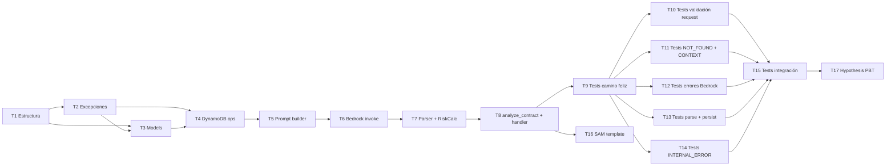

# Implementation Plan: Módulo 2 — Motor de Análisis

## Overview

Este plan implementa el Módulo 2 (Motor de Análisis) de Claro y Simple en 17 tasks, siguiendo `design.md` y `requirements.md` ya aprobados. El orden está deliberadamente priorizado por riesgo de demo: primero la infraestructura base y modelos (Fase 1), después el camino feliz completo incluyendo cache hit (Fase 2), después los casos de error uno por uno (Fase 3), después los tests de integración contra LocalStack (Fase 4), después la infraestructura SAM (Fase 5). La Fase 6 (property-based testing con Hypothesis) queda al final a propósito: es lo primero que se recorta si el tiempo apremia antes de la demo, sin comprometer el flujo principal.

## Task Dependency Graph



```json
{
  "waves": [
    { "wave": 1,  "tasks": ["T1"] },
    { "wave": 2,  "tasks": ["T2"] },
    { "wave": 3,  "tasks": ["T3"] },
    { "wave": 4,  "tasks": ["T4"] },
    { "wave": 5,  "tasks": ["T5"] },
    { "wave": 6,  "tasks": ["T6"] },
    { "wave": 7,  "tasks": ["T7"] },
    { "wave": 8,  "tasks": ["T8"] },
    { "wave": 9,  "tasks": ["T9", "T16"] },
    { "wave": 10, "tasks": ["T10", "T11", "T12", "T13", "T14"] },
    { "wave": 11, "tasks": ["T15"] },
    { "wave": 12, "tasks": ["T17"] }
  ]
}
```

---

## Tasks

### Fase 1 — Infraestructura base

- [ ] 1. Crear estructura de carpetas y requirements.txt

  **Archivos**: `backend/analysis/__init__.py`, `backend/analysis/tests/__init__.py`, `backend/analysis/requirements.txt`, `backend/analysis/.env.example`
  **Requisitos**: Req 15
  **Descripción**: Crear los paquetes Python del módulo con `__init__.py` vacíos. Crear `requirements.txt` con las dependencias de producción y desarrollo: `pydantic>=2.0`, `aws-lambda-powertools`, `boto3`, `hypothesis`, `pytest`, `moto[dynamodb]`. Crear `backend/analysis/.env.example` con todas las variables de entorno documentadas: `EXTRACTIONS_TABLE_NAME`, `ANALYSES_TABLE_NAME`, `BEDROCK_MODEL_ID`, `MAX_CONTEXT_CHARS`, `BEDROCK_TIMEOUT_SECONDS`, `AWS_ENDPOINT_URL`, `AWS_REGION`, `LOG_LEVEL` — con valores de ejemplo para LocalStack (mismo patrón que `backend/ingestion/.env.example`).
  **Criterio de completitud**: Los archivos existen; `python -m pytest --collect-only` sobre `backend/analysis` no da `ImportError`.


- [ ] 2. Agregar nuevas excepciones a `backend/shared/exceptions.py`

  **Archivos**: `backend/shared/exceptions.py`
  **Requisitos**: Req 14, Req 1, Req 3, Req 4, Req 6, Req 7
  **Descripción**: Agregar al archivo **existente** (no crear archivo nuevo) las siguientes clases, exactamente como están definidas en `design.md` sección "Nuevas excepciones": `BedrockErrorCode` (enum con `BEDROCK_TIMEOUT`, `BEDROCK_THROTTLED`, `BEDROCK_SERVICE_ERROR`), `BedrockError` (con atributos `error_code` y `message`), `AnalysisErrorCode` (enum con `MISSING_DOCUMENT_ID`, `INVALID_DOCUMENT_ID`, `DOCUMENT_NOT_FOUND`, `CONTEXT_TOO_LONG`, `MODEL_RESPONSE_INVALID`), `AnalysisError` (con atributos `error_code` y `message`). No modificar ni tocar las clases del Módulo 1 ya existentes (`ExtractionErrorCode`, `ExtractionError`, `StorageError`, `ValidationError`, `ConfigurationError`).
  **Criterio de completitud**: `from shared.exceptions import BedrockError, BedrockErrorCode, AnalysisError, AnalysisErrorCode` no lanza error; `BedrockErrorCode.BEDROCK_TIMEOUT.value == "BEDROCK_TIMEOUT"` es `True`; las clases del Módulo 1 siguen importando sin error.


- [ ] 3. Implementar `backend/analysis/models.py`

  **Archivos**: `backend/analysis/models.py`
  **Requisitos**: Req 9, Req 10, Contrato 2, Contrato 4
  **Descripción**: Implementar en un único archivo todos los modelos definidos en `design.md` sección "Data Models": `ClauseCategory` (Literal con 5 valores), `RiskLevel` (Literal con 3 valores), `Clause` (con `clause_text` Field(min_length=1), `category`, `risk_level`, `explanation`, `suggested_question`), `AnalysisResult` (con `document_id`, `summary_plain`, `risk_score` Field(ge=0, le=100), `clauses`, `overall_recommendation`), `ModelClause` (igual a Clause pero del modelo de IA), `ModelResponse` (con `summary_plain`, `clauses: list[ModelClause]`, `overall_recommendation` — sin `risk_score`), `AnalyzeErrorCode` (enum con los 10 valores del Contrato 4: `MISSING_DOCUMENT_ID`, `INVALID_DOCUMENT_ID`, `DOCUMENT_NOT_FOUND`, `CONTEXT_TOO_LONG`, `MODEL_RESPONSE_INVALID`, `BEDROCK_TIMEOUT`, `BEDROCK_THROTTLED`, `BEDROCK_SERVICE_ERROR`, `PERSISTENCE_FAILURE`, `INTERNAL_ERROR`), `AnalyzeSuccessResponse` (Contrato 2 + `cached: bool = False`), `AnalyzeErrorResponse` (con `error_code`, `message`, `document_id: Optional[str] = None`). Agregar helper `build_analysis_dynamodb_item(result: AnalysisResult) -> dict` que serializa al formato `AttributeValue` con TTL de 604800 segundos (7 días). Agregar helper `deserialize_analysis_item(item: dict) -> dict` que convierte de `AttributeValue` a dict plano compatible con `AnalysisResult`.
  **Criterio de completitud**: `AnalysisResult(risk_score=101, ...)` lanza `ValidationError` de Pydantic; `AnalyzeErrorCode.PERSISTENCE_FAILURE.value == "PERSISTENCE_FAILURE"` es `True`; `build_analysis_dynamodb_item` produce dict con clave `ttl` en formato `{"N": "..."}`.


---

### Fase 2 — Camino feliz (Camino B: análisis nuevo exitoso + Camino A: cache hit)

- [ ] 4. Implementar validación de request y operaciones DynamoDB en `analyzer.py`

  **Archivos**: `backend/analysis/analyzer.py`
  **Requisitos**: Req 1, Req 2, Req 3, Req 9
  **Descripción**: Crear el archivo `backend/analysis/analyzer.py`. Inicializar a nivel de módulo los clientes DynamoDB con `get_boto3_client("dynamodb")` (uno para cada tabla). Implementar las siguientes funciones con type hints y docstrings: `validate_document_id(body: dict) -> str` — verifica presencia y no vacuidad del campo `document_id`, luego valida formato UUID v4 con regex exacto `^[0-9a-f]{8}-[0-9a-f]{4}-4[0-9a-f]{3}-[89ab][0-9a-f]{3}-[0-9a-f]{12}$`; lanza `AnalysisError(MISSING_DOCUMENT_ID)` si ausente/vacío, `AnalysisError(INVALID_DOCUMENT_ID)` si formato inválido; retorna el `document_id` validado. `get_cached_analysis(document_id: str) -> dict | None` — hace `get_item` en la tabla `ANALYSES_TABLE_NAME`; retorna el resultado deserializado con `deserialize_analysis_item` si existe, `None` si no. `get_extraction(document_id: str) -> dict` — hace `get_item` en la tabla `EXTRACTIONS_TABLE_NAME`; lanza `AnalysisError(DOCUMENT_NOT_FOUND)` si no existe; retorna el ítem deserializado (al menos `raw_text`). `persist_analysis(result: AnalysisResult) -> None` — llama `build_analysis_dynamodb_item`, luego `put_item` en `ANALYSES_TABLE_NAME`; captura cualquier excepción y re-lanza como `StorageError(PERSISTENCE_FAILURE)`.
  **Criterio de completitud**: `validate_document_id({})` lanza `AnalysisError` con `error_code == AnalysisErrorCode.MISSING_DOCUMENT_ID`; `validate_document_id({"document_id": "no-es-uuid"})` lanza `AnalysisError` con `error_code == AnalysisErrorCode.INVALID_DOCUMENT_ID`; `validate_document_id({"document_id": "550e8400-e29b-41d4-a716-446655440000"})` retorna el UUID sin lanzar.


- [ ] 5. Implementar prompt builder y template en `analyzer.py` y `prompts/clause_analysis.txt`

  **Archivos**: `backend/analysis/analyzer.py`, `backend/analysis/prompts/clause_analysis.txt`
  **Requisitos**: Req 4, Req 5
  **Descripción**: Crear el directorio `backend/analysis/prompts/` y el archivo `backend/analysis/prompts/clause_analysis.txt` con el template completo en español tal como está definido en `design.md` sección "Prompt Template" — instruyendo al modelo a retornar JSON con `summary_plain`, `clauses` (array con `clause_text`, `category`, `risk_level`, `explanation`, `suggested_question`), y `overall_recommendation`; listando las categorías válidas y los niveles de riesgo válidos; indicando explícitamente que NO debe incluir `risk_score`; con el placeholder `{raw_text}` al final. En `analyzer.py` implementar: `validate_context_length(raw_text: str) -> None` — verifica `len(raw_text) <= MAX_CONTEXT_CHARS` (leído de variable de entorno con `int(os.environ["MAX_CONTEXT_CHARS"])`); lanza `AnalysisError(CONTEXT_TOO_LONG)` si excede. `build_prompt(raw_text: str) -> str` — carga el template desde `prompts/clause_analysis.txt` usando `Path(__file__).parent / "prompts" / "clause_analysis.txt"`; inyecta `raw_text` con `template.format(raw_text=raw_text)`; retorna el prompt completo.
  **Criterio de completitud**: Con `MAX_CONTEXT_CHARS=100` en el entorno, `validate_context_length("a" * 101)` lanza `AnalysisError(CONTEXT_TOO_LONG)`; `build_prompt("texto")` retorna un string que contiene `"texto"` y no contiene el placeholder literal `"{raw_text}"`.


- [ ] 6. Implementar invocación de Bedrock en `analyzer.py`

  **Archivos**: `backend/analysis/analyzer.py`
  **Requisitos**: Req 6
  **Descripción**: Inicializar a nivel de módulo el cliente `bedrock-runtime` con `get_boto3_client("bedrock-runtime")`. Implementar `invoke_bedrock(prompt: str) -> str` que: lee `BEDROCK_MODEL_ID` y `BEDROCK_TIMEOUT_SECONDS` de variables de entorno; construye el payload en el formato de la API de mensajes de Anthropic para Bedrock — este formato es específico de la **familia Claude** y no es compatible con Amazon Nova: `{"messages": [{"role": "user", "content": prompt}], "max_tokens": 4096, "anthropic_version": "bedrock-2023-05-31"}`; llama a `bedrock_client.invoke_model` con `body=json.dumps(payload)`, `modelId=BEDROCK_MODEL_ID`, y `config=Config(read_timeout=int(BEDROCK_TIMEOUT_SECONDS))`; extrae el contenido de texto de la respuesta Claude (`response["body"].read()` → `json.loads` → `data["content"][0]["text"]`); captura `ReadTimeoutError` → lanza `BedrockError(BEDROCK_TIMEOUT, ...)`, captura `ClientError` con código `"ThrottlingException"` → lanza `BedrockError(BEDROCK_THROTTLED, ...)`, captura otras `ClientError` → lanza `BedrockError(BEDROCK_SERVICE_ERROR, ...)`; retorna el string de la respuesta del modelo. **`BEDROCK_MODEL_ID` debe configurarse con un modelo de la familia Claude** — si en el futuro se quiere usar Amazon Nova, esta función requiere reescritura para usar el schema de request de Nova (`inferenceConfig`).
  **Criterio de completitud**: Con mock de `invoke_model` que lanza `ReadTimeoutError`, `invoke_bedrock("prompt")` lanza `BedrockError` con `error_code == BedrockErrorCode.BEDROCK_TIMEOUT`; con mock que lanza `ClientError` con código `"ThrottlingException"`, lanza `BedrockError(BEDROCK_THROTTLED)`; con mock que lanza `ClientError` con otro código, lanza `BedrockError(BEDROCK_SERVICE_ERROR)`.


- [ ] 7. Implementar Response Parser y Risk Calculator en `analyzer.py`

  **Archivos**: `backend/analysis/analyzer.py`
  **Requisitos**: Req 7, Req 8
  **Descripción**: Implementar `parse_model_response(raw_response: str) -> ModelResponse` que: intenta `json.loads(raw_response)` — si falla lanza `AnalysisError(MODEL_RESPONSE_INVALID, ...)`; intenta construir `ModelResponse(**data)` con Pydantic — si falla por campos faltantes, tipos incorrectos, o valores de enum inválidos (`category` fuera de `ClauseCategory`, `risk_level` fuera de `RiskLevel`) lanza `AnalysisError(MODEL_RESPONSE_INVALID, ...)`; retorna el `ModelResponse` validado. Implementar `calculate_risk_score(clauses: list[Clause]) -> int` con pesos `{"bajo": 10, "medio": 25, "alto": 45}`: si lista vacía retorna `0`; calcula `raw_score = sum(RISK_WEIGHTS[c.risk_level] for c in clauses)`; retorna `min(raw_score, 100)`. Definir la constante `RISK_WEIGHTS: dict[str, int]` a nivel de módulo.
  **Criterio de completitud**: `parse_model_response("no es json")` lanza `AnalysisError(MODEL_RESPONSE_INVALID)`; `parse_model_response('{"summary_plain": "x", "clauses": [], "overall_recommendation": "y"}')` retorna `ModelResponse` sin lanzar; `calculate_risk_score([])` retorna `0`; `calculate_risk_score` con 3 cláusulas `alto` retorna `100` (clamped de 135).


- [ ] 8. Implementar `analyze_contract` en `analyzer.py` y `lambda_handler` en `handler.py`

  **Archivos**: `backend/analysis/analyzer.py`, `backend/analysis/handler.py`
  **Requisitos**: Req 1, 2, 3, 4, 5, 6, 7, 8, 9, 10, 13, 14, 15
  **Descripción**: En `analyzer.py`, implementar `analyze_contract(raw_text: str, document_id: str) -> AnalysisResult` que orquesta: `validate_context_length(raw_text)` → `build_prompt(raw_text)` → `invoke_bedrock(prompt)` → `parse_model_response(raw_response)` → `calculate_risk_score(model_response.clauses)` → construir y retornar `AnalysisResult` completo con todos los campos del Contrato 2. En `handler.py`, implementar: inicialización module-scope — leer `EXTRACTIONS_TABLE_NAME`, `ANALYSES_TABLE_NAME`, `BEDROCK_MODEL_ID`, `MAX_CONTEXT_CHARS`, `BEDROCK_TIMEOUT_SECONDS` con `os.environ`; si alguno falta lanzar `ConfigurationError`; inicializar logger de `aws-lambda-powertools` con `Logger()`. Implementar `http_response(status_code: int, body: dict) -> dict` que retorna dict con `statusCode`, `headers: {"Content-Type": "application/json"}`, `body: json.dumps(body, ensure_ascii=False)`. Implementar `lambda_handler(event: dict, context: object) -> dict` que orquesta los 10 pasos del flujo, convierte cada tipo de excepción al HTTP status correcto según la tabla de `design.md`, loguea con `logger.warning` o `logger.error` según la tabla, incluye `document_id` en las respuestas de error cuando está disponible, y captura `Exception` genérica → HTTP 500 `INTERNAL_ERROR` sin exponer detalles internos.
  **Criterio de completitud**: Con mocks de DynamoDB (vacío) y Bedrock (retorna JSON válido), `lambda_handler({"body": '{"document_id": "550e8400-e29b-41d4-a716-446655440000"}'}, ctx)` retorna `{"statusCode": 404, ...}` con `error_code == "DOCUMENT_NOT_FOUND"`.


- [ ] 9. Tests unitarios del camino feliz (Camino B + Camino A)

  **Archivos**: `backend/analysis/tests/test_analyzer.py`, `backend/analysis/tests/conftest.py`
  **Requisitos**: Req 2, Req 10, Req 11
  **Descripción**: Crear `conftest.py` con fixtures: `lambda_context` (objeto con `aws_request_id="test-request-id"`), helper `make_event(document_id)` que construye un evento API Gateway con `body=json.dumps({"document_id": document_id})`, helper `make_extraction_item(document_id, raw_text)` que construye un ítem DynamoDB en formato `AttributeValue` simulando un registro de `ContractExtractions`. Implementar en `test_analyzer.py` los siguientes tests usando `unittest.mock.patch` para DynamoDB y Bedrock: `test_successful_analysis_flow` — mock `get_item` en `ContractAnalyses` retorna vacío (sin cache), mock `get_item` en `ContractExtractions` retorna ítem con `raw_text`, mock `invoke_model` retorna JSON válido con cláusulas; verificar HTTP 200, `cached == False`, todos los campos del Contrato 2 presentes, `put_item` llamado exactamente una vez. `test_zero_clauses` — Bedrock retorna `clauses=[]`; verificar HTTP 200, `risk_score == 0`, `clauses == []`, `cached == False`. `test_cache_hit_returns_cached_true` — mock `get_item` en `ContractAnalyses` retorna resultado previo; verificar HTTP 200, `cached == True`, todos los campos del Contrato 2 presentes. `test_cache_hit_no_bedrock_call` — mismo setup que cache hit; verificar que `mock_bedrock.invoke_model.assert_not_called()` pasa.
  **Criterio de completitud**: `pytest backend/analysis/tests/test_analyzer.py -v -k "happy or cache"` pasa los 4 tests.


---

### Fase 3 — Casos de error

- [ ] 10. Tests de validación de request

  **Archivos**: `backend/analysis/tests/test_analyzer.py`
  **Requisitos**: Req 1
  **Descripción**: Implementar los siguientes tests, todos verificando que DynamoDB no fue consultado en ningún caso de falla de validación (usando `assert_not_called()` en el mock de `get_item`): `test_missing_document_id` — body sin campo `document_id` → HTTP 400, `error_code == "MISSING_DOCUMENT_ID"`, `document_id` ausente en el body de respuesta. `test_empty_document_id` — body con `document_id=""` → HTTP 400, `error_code == "MISSING_DOCUMENT_ID"`. `test_invalid_document_id_format` — UUID malformado como `"no-es-uuid-valido"` → HTTP 400, `error_code == "INVALID_DOCUMENT_ID"`. `test_invalid_document_id_v1` — UUID v1 (sin el `4` en la posición correcta) → HTTP 400, `error_code == "INVALID_DOCUMENT_ID"`. En todos los casos de error 400 verificar que `Content-Type: application/json` está en los headers.
  **Criterio de completitud**: `pytest backend/analysis/tests/test_analyzer.py -v -k "validation or missing or invalid_doc"` pasa los 4 tests; `mock_dynamodb.get_item.assert_not_called()` pasa en todos.


- [ ] 11. Tests de DOCUMENT_NOT_FOUND y CONTEXT_TOO_LONG

  **Archivos**: `backend/analysis/tests/test_analyzer.py`
  **Requisitos**: Req 3, Req 4
  **Descripción**: `test_document_not_found` — mock `get_item` en `ContractAnalyses` retorna vacío, mock `get_item` en `ContractExtractions` retorna vacío (documento no existe); verificar HTTP 404, `error_code == "DOCUMENT_NOT_FOUND"`, `document_id` presente en el body de respuesta (porque el UUID era válido). `test_context_too_long` — mock `ContractAnalyses` vacío, mock `ContractExtractions` retorna ítem con `raw_text` de longitud `MAX_CONTEXT_CHARS + 1`; verificar HTTP 422, `error_code == "CONTEXT_TOO_LONG"`, `document_id` presente en respuesta, Bedrock no invocado (`mock_bedrock.invoke_model.assert_not_called()`).
  **Criterio de completitud**: `pytest backend/analysis/tests/test_analyzer.py -v -k "not_found or context"` pasa los 2 tests; en `test_context_too_long` el mock de Bedrock no fue llamado.

- [ ] 12. Tests de errores de Bedrock

  **Archivos**: `backend/analysis/tests/test_analyzer.py`
  **Requisitos**: Req 6
  **Descripción**: En los 3 tests, el setup base es: `ContractAnalyses` vacío (sin cache), `ContractExtractions` con `raw_text` válido, `invoke_model` configurado para lanzar el error correspondiente. `test_bedrock_timeout` — `invoke_model` lanza `ReadTimeoutError`; verificar HTTP 503, `error_code == "BEDROCK_TIMEOUT"`, `document_id` presente. `test_bedrock_throttled` — `invoke_model` lanza `ClientError` con código `"ThrottlingException"`; verificar HTTP 503, `error_code == "BEDROCK_THROTTLED"`. `test_bedrock_service_error` — `invoke_model` lanza `ClientError` genérica (código distinto de `"ThrottlingException"`); verificar HTTP 502, `error_code == "BEDROCK_SERVICE_ERROR"`. En los 3 tests verificar que `mock_dynamodb.put_item.assert_not_called()` pasa (los errores de Bedrock no persisten nada).
  **Criterio de completitud**: `pytest backend/analysis/tests/test_analyzer.py -v -k "bedrock"` pasa los 3 tests; `put_item` tiene 0 llamadas en todos.


- [ ] 13. Tests de MODEL_RESPONSE_INVALID y PERSISTENCE_FAILURE

  **Archivos**: `backend/analysis/tests/test_analyzer.py`
  **Requisitos**: Req 7, Req 9
  **Descripción**: En los tests de parseo, el setup base es: `ContractAnalyses` vacío, `ContractExtractions` con `raw_text` válido, `invoke_model` exitoso pero con la respuesta defectuosa indicada. `test_model_response_invalid_json` — `invoke_model` retorna string `"esto no es json"` como body; verificar HTTP 422, `error_code == "MODEL_RESPONSE_INVALID"`. `test_model_response_missing_fields` — `invoke_model` retorna JSON `{"clauses": []}` (sin `summary_plain` ni `overall_recommendation`); verificar HTTP 422, `error_code == "MODEL_RESPONSE_INVALID"`. `test_model_response_invalid_enum` — `invoke_model` retorna JSON con una cláusula con `"risk_level": "muy_alto"` (valor inválido); verificar HTTP 422, `error_code == "MODEL_RESPONSE_INVALID"`. `test_persistence_failure` — `invoke_model` exitoso con respuesta válida, `put_item` lanza `ClientError`; verificar HTTP 502, `error_code == "PERSISTENCE_FAILURE"`, `document_id` presente.
  **Criterio de completitud**: `pytest backend/analysis/tests/test_analyzer.py -v -k "model_response or persistence"` pasa los 4 tests.

- [ ] 14. Tests de INTERNAL_ERROR

  **Archivos**: `backend/analysis/tests/test_analyzer.py`
  **Requisitos**: Req 14
  **Descripción**: `test_internal_error_no_leak` — forzar una excepción inesperada mockeando `get_cached_analysis` para que lance `Exception("detalle interno secreto")`; verificar HTTP 500, `error_code == "INTERNAL_ERROR"`, que el body de respuesta NO contiene el string `"detalle interno secreto"`, que el body NO contiene el término `"Traceback"`, que `message` es un string no vacío. Verificar adicionalmente que el mock de logger captura una llamada a `logger.exception` con el traceback (para confirmar que se loguea internamente aunque no se exponga al cliente).
  **Criterio de completitud**: `pytest backend/analysis/tests/test_analyzer.py -v -k "internal"` pasa el test; `assert "detalle interno secreto" not in body` pasa.


---

### Fase 4 — Tests de integración contra LocalStack

- [ ] 15. Implementar `tests/test_integration.py`

  **Archivos**: `backend/analysis/tests/test_integration.py`
  **Requisitos**: Req 2, Req 3, Req 9
  **Descripción**: Documentar al inicio del archivo la precondición: LocalStack debe estar corriendo y `scripts/setup-localstack.sh` debe haberse ejecutado. Marcar todos los tests con `@pytest.mark.integration`. Bedrock siempre mockeado (no tiene emulación en LocalStack). `test_integration_full_flow` — escribir un ítem directamente en la tabla `ContractExtractions` real de LocalStack usando `put_item` con todos los campos del Contrato 1; llamar `lambda_handler` con un UUID válido; verificar HTTP 200, `cached == False`; leer el ítem de `ContractAnalyses` real y verificar que todos los campos del Contrato 2 están presentes con los valores correctos; verificar que el atributo `ttl` existe y está en el futuro (mayor al timestamp actual). `test_integration_cache_hit` — ejecutar el análisis dos veces con el mismo `document_id`; en el primer llamado mockear Bedrock; en el segundo llamado verificar HTTP 200, `cached == True`, y que el mock de Bedrock fue invocado exactamente 1 vez en total (no 2). `test_integration_document_not_found` — llamar `lambda_handler` con un `document_id` que no existe en `ContractExtractions`; verificar HTTP 404, `error_code == "DOCUMENT_NOT_FOUND"`.
  **Criterio de completitud**: Con LocalStack activo, `ENVIRONMENT=localstack pytest backend/analysis/tests/test_integration.py -v -m integration` pasa los 3 tests.


---

### Fase 5 — SAM template

- [ ] 16. Agregar `AnalysisFunction` y `ContractAnalysesTable` a `infra/template.yaml`

  **Archivos**: `infra/template.yaml`
  **Requisitos**: Req 12, Req 15
  **Descripción**: Agregar al template SAM existente (sin modificar los recursos del Módulo 1 ya presentes): Recurso `ContractAnalysesTable` de tipo `AWS::Serverless::SimpleTable` o `AWS::DynamoDB::Table` con `BillingMode: PAY_PER_REQUEST`, TTL habilitado sobre el atributo `ttl`, y tag `project: hackaton`. Recurso `AnalysisFunction` de tipo `AWS::Serverless::Function` con: `Handler: handler.lambda_handler`, `Runtime: python3.12`, `CodeUri: ../backend/analysis/`, `Timeout: 60` (mayor que `BEDROCK_TIMEOUT_SECONDS` de 45s), `MemorySize: 256`. Variables de entorno: `EXTRACTIONS_TABLE_NAME: !Ref ContractExtractionsTable`, `ANALYSES_TABLE_NAME: !Ref ContractAnalysesTable`, `BEDROCK_MODEL_ID: !Ref BedrockModelId` (o parámetro equivalente), `MAX_CONTEXT_CHARS: "150000"`, `BEDROCK_TIMEOUT_SECONDS: "45"`, `ENVIRONMENT: !Ref EnvironmentName`, `LOG_LEVEL: INFO` — sin `AWS_REGION` (Lambda la provee automáticamente). Policies: `DynamoDBReadPolicy` sobre `ContractExtractionsTable`, `DynamoDBWritePolicy` sobre `ContractAnalysesTable`, statement IAM para `bedrock:InvokeModel` sobre `"*"`. Evento `AnalyzeApi` de tipo `Api` con `Path: /analyze`, `Method: post`, y `Auth: ApiKey`. Tag `project: hackaton` en `AnalysisFunction`.
  **Criterio de completitud**: `sam validate --template infra/template.yaml` no reporta errores; el recurso `ContractAnalysesTable` aparece en el output de `sam list resources`.


---

### Fase 6 — Property-based testing (baja prioridad)

- [ ] 17. Property-based tests con Hypothesis

  **Archivos**: `backend/analysis/tests/test_analyzer.py`
  **Requisitos**: Req 1, Req 8, Req 9
  **Descripción**: Implementar los siguientes tests con `@given` de Hypothesis y `@settings(max_examples=100)`. Cada test debe incluir en su docstring el formato `Feature: analysis, Property N: ...` referenciando la property del `design.md`. `test_risk_score_bounded` (Property 1) — generar listas aleatorias de `Clause` con `risk_level` en `{"bajo", "medio", "alto"}`; verificar que `calculate_risk_score(clauses)` siempre retorna entero en `[0, 100]`. `test_risk_score_monotonic` (Property 2) — generar lista base de clauses y una cláusula adicional; verificar que `calculate_risk_score(clauses + [extra_clause]) >= calculate_risk_score(clauses)`. `test_risk_score_zero_empty` (Property 3) — sin `@given` (lista vacía es constante); verificar `calculate_risk_score([]) == 0`. `test_serialization_round_trip` (Property 4) — generar `AnalysisResult` aleatorios con todos sus campos; aplicar `build_analysis_dynamodb_item` → `deserialize_analysis_item`; verificar que `document_id`, `summary_plain`, `risk_score`, `clauses`, y `overall_recommendation` son idénticos al original. `test_invalid_uuid_rejected` (Property 7) — generar strings que no matchean el regex UUID v4; verificar que `validate_document_id({"document_id": s})` lanza `AnalysisError` con `error_code` `MISSING_DOCUMENT_ID` o `INVALID_DOCUMENT_ID`.

  **Nota sobre Properties 5, 6 y 8 — omisión deliberada**: las Properties 5 y 6 (rechazo/preservación de respuesta del modelo) están cubiertas por tests unitarios concretos en la Task 13, que ejercen exactamente los mismos invariantes con ejemplos específicos y no se benefician significativamente de la generación aleatoria de Hypothesis (el espacio de inputs válidos/inválidos es acotado y ya está muestreado en Task 13). La Property 8 (safety ante excepciones inesperadas) está cubierta por Task 14 con un ejemplo canónico; el valor adicional de un PBT sería verificar que ningún tipo de excepción filtra detalles — lo cual requeriría un generador de excepciones arbitrarias de mayor complejidad que no justifica el tiempo de hackathon. Esta omisión es una decisión explícita, no un olvido.
  **Criterio de completitud**: `pytest backend/analysis/tests/test_analyzer.py -v -k "property or pbt" --hypothesis-show-statistics` pasa con Hypothesis explorando al menos 100 casos por property; no hay falsificaciones ni shrinking que produzca un error no manejado.


---

## Notes

- **Precondición de la Fase 4**: los tests de integración (Task 15) requieren que `scripts/setup-localstack.sh` se haya ejecutado con el container de LocalStack activo antes de correrlos. El script crea ambas tablas DynamoDB (`ContractExtractions` con TTL 24h y `ContractAnalyses` con TTL 7 días). El container arranca vacío en cada reinicio.
- **Bedrock nunca se emula**: en TODOS los tests (unitarios y de integración), Bedrock se mockea con `unittest.mock`. Esto incluye la Fase 4 contra LocalStack. El único momento en que el camino real de Bedrock se valida es al desplegar contra AWS real.
- **Orden no es solo sugerido**: el grafo de dependencias refleja requisitos reales de import (Task 3 necesita Task 2, Task 4 necesita Task 3, etc.). Saltear tasks fuera de orden producirá errores de import que no son bugs de la implementación.
- **Variables de entorno en tests**: los tests unitarios (Fases 2-3) deben setear las variables de entorno necesarias en fixtures o con `monkeypatch` de pytest — no depender del `.env` del módulo. Los tests de integración (Fase 4) leen del entorno real vía `.env.localstack.example` o `ENVIRONMENT=localstack`.
- **Fase 6 es recortable**: si el tiempo apremia antes de la demo, la Task 17 (Hypothesis) es la primera en sacrificarse sin comprometer el flujo principal ni los contratos de interfaz.
