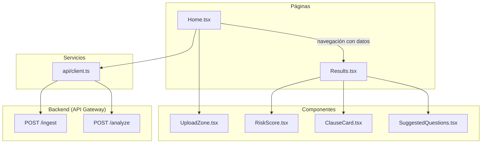
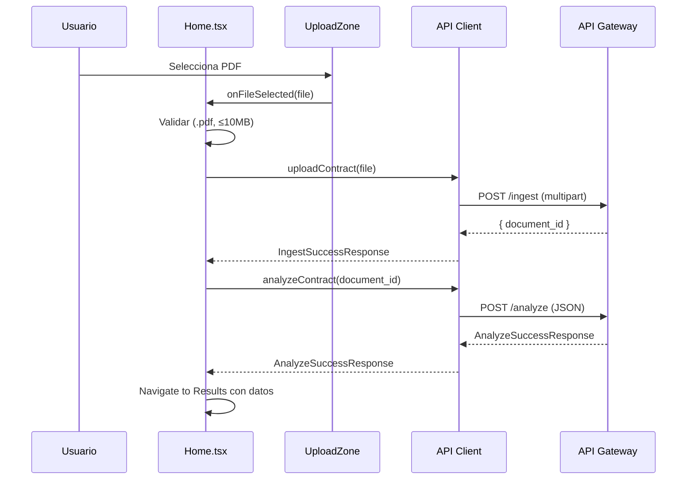
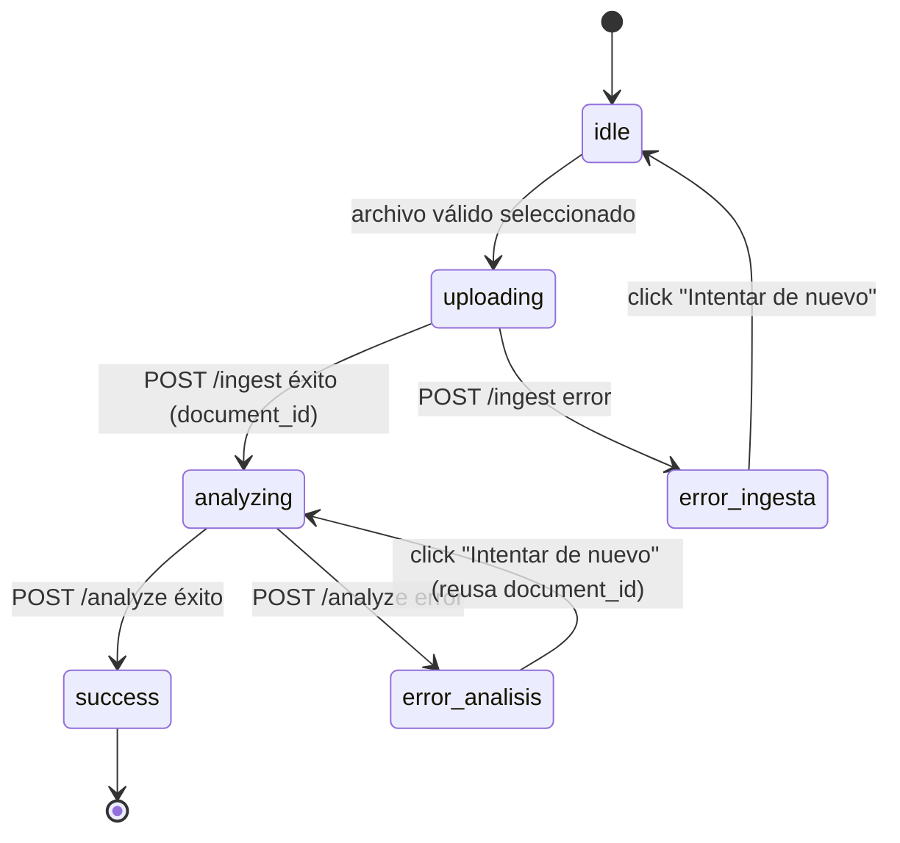

# Design

## Overview

Diseño del Módulo 3 (Frontend) de "Claro y Simple": una aplicación React + TypeScript que permite a usuarios sin formación legal subir un contrato en PDF y recibir un análisis comprensible de sus cláusulas de riesgo.

### Flujo del usuario

1. El usuario llega a la página Home y ve la Upload_Zone
2. Selecciona un PDF (drag & drop o file picker)
3. El frontend valida client-side: extensión .pdf y tamaño ≤ 10 MB
4. Se envía el archivo al endpoint POST /ingest (estado: "Subiendo tu contrato...")
5. Al recibir el document_id, se dispara POST /analyze automáticamente (estado: "Analizando tu contrato...")
6. Al recibir el resultado, se navega a la Results_Page
7. La Results_Page muestra: resumen, score de riesgo, cláusulas ordenadas por gravedad, preguntas sugeridas y recomendación general

### Decisiones de diseño clave

- **Color desacoplado del score numérico**: el color del Risk_Score_Display se deriva del risk_level más grave presente en las cláusulas, no del valor numérico. Una sola cláusula de riesgo alto siempre muestra rojo, sin importar que el score sea 25/100.
- **Retry diferenciado por etapa**: errores de ingesta → el usuario vuelve a subir un archivo; errores de análisis → se re-invoca POST /analyze con el document_id existente (el texto ya fue extraído exitosamente).
- **Sin persistencia entre sesiones**: no se usa localStorage ni cookies. Cada sesión es independiente.
- **Tailwind CSS**: estilizado utilitario para velocidad de desarrollo en el hackathon.
- **Validación client-side preventiva**: se rechazan archivos no-PDF y mayores a 10 MB antes de hacer cualquier llamada de red.

---

## Architecture

### Diagrama de componentes



### Flujo de datos



### Estructura de archivos

```
frontend/
├── src/
│   ├── components/
│   │   ├── UploadZone.tsx
│   │   ├── RiskScore.tsx
│   │   ├── ClauseCard.tsx
│   │   └── SuggestedQuestions.tsx
│   ├── pages/
│   │   ├── Home.tsx
│   │   └── Results.tsx
│   ├── api/
│   │   └── client.ts
│   └── types/
│       └── contract.ts
├── public/
├── package.json
└── vite.config.ts
```

---

## Dirección Visual

Reglas mínimas de consistencia visual para que cualquier implementador mantenga coherencia entre componentes sin tener que decidir de cero.

### Estética general
- Minimalista, espaciado generoso (padding/margin de Tailwind `p-6`, `gap-4` mínimo entre bloques)
- Tipografía clara y legible: `font-sans` del sistema, tamaños `text-base` para cuerpo y `text-2xl`/`text-3xl` para títulos
- Priorizar legibilidad para un usuario sin formación técnica ni legal — no una estética "developer tool"
- Fondo claro (`bg-white` o `bg-gray-50`), texto oscuro (`text-gray-900`)

### Estados de carga
- Spinner simple implementado con Tailwind puro (un `div` con `animate-spin border-2 rounded-full`) — sin librerías de animación externas
- El mensaje de texto definido en Requirements ("Subiendo tu contrato...", "Analizando tu contrato...") es el protagonista visual — centrado y en tamaño `text-lg`
- El spinner es secundario: tamaño pequeño (`w-6 h-6`), posicionado antes del texto

### Transiciones
- Sutiles: `transition-opacity duration-200` y `transition-colors duration-150` de Tailwind
- Nada que retrase la percepción de velocidad — si la transición no es instantánea a la vista, no se usa
- Los cambios de estado (idle → uploading → analyzing → results) son inmediatos; solo los hover y focus usan transición

### Paleta de riesgo (consistente entre RiskScore y ClauseCard)

| Nivel | Clase Tailwind texto | Clase Tailwind background | Uso |
|---|---|---|---|
| Alto | `text-red-600` | `bg-red-50` / `border-red-600` | RiskScore etiqueta, ClauseCard badge y borde |
| Medio | `text-amber-500` | `bg-amber-50` / `border-amber-500` | RiskScore etiqueta, ClauseCard badge y borde |
| Bajo | `text-green-600` | `bg-green-50` / `border-green-600` | RiskScore etiqueta, ClauseCard badge y borde |

Estos tonos exactos deben usarse en ambos componentes sin variación. No usar red-500 en uno y red-700 en otro.

---

## Components and Interfaces

### UploadZone.tsx

**Props:**

```typescript
interface UploadZoneProps {
  onFileSelected: (file: File) => void;
  disabled: boolean;
}
```

**Estado interno:**

```typescript
type UploadZoneState = "idle" | "dragOver";
```

**Comportamiento:**
- En estado `idle`: muestra zona con instrucción de drag & drop y botón "Seleccionar archivo"
- En estado `dragOver`: aplica estilo visual (borde coloreado, fondo highlight) indicando que se puede soltar
- Cuando `disabled=true`: deshabilita la interacción (durante uploading/analyzing)
- Validación client-side al recibir archivo:
  - Si no es `.pdf` → muestra "Solo se aceptan archivos en formato PDF"
  - Si supera 10 MB → muestra "El archivo supera el tamaño máximo permitido (10 MB)"
  - Si es válido → llama `onFileSelected(file)`

---

### RiskScore.tsx

**Props:**

```typescript
interface RiskScoreProps {
  riskScore: number;   // 0-100
  clauses: Clause[];
}
```

**Lógica de derivación de color:**

```typescript
function deriveRiskDisplay(clauses: Clause[]): { color: string; label: string } {
  if (clauses.some(c => c.risk_level === "alto")) {
    return { color: "red", label: "Riesgo alto" };
  }
  if (clauses.some(c => c.risk_level === "medio")) {
    return { color: "amber", label: "Riesgo medio" };
  }
  return { color: "green", label: "Riesgo bajo" };
}
```

**Comportamiento:**
- Muestra el valor numérico del `riskScore` de forma prominente (ej: "75/100") con un subtítulo `text-sm text-gray-500` debajo del número: "Puntaje acumulado"
- Aplica color y etiqueta textual basándose en el risk_level más grave de las cláusulas, con un subtítulo `text-sm text-gray-500` debajo de la etiqueta: "Basado en la cláusula más grave detectada"
- Con clauses vacío → verde, "Riesgo bajo", subtítulo "No se detectaron cláusulas de riesgo"
- Los dos subtítulos ("Puntaje acumulado" y "Basado en la cláusula más grave detectada") evitan que el usuario perciba contradicción cuando el número es alto pero la etiqueta dice un nivel menor (ej: risk_score=85 con "Riesgo medio" porque ninguna cláusula individual es "alto")

---

### ClauseCard.tsx

**Props:**

```typescript
interface ClauseCardProps {
  clause: Clause;
}
```

**Mapeo de categoría a etiqueta en español:**

| `category` | Etiqueta |
|---|---|
| `renovacion_automatica` | Renovación automática |
| `multa` | Multa |
| `jurisdiccion` | Jurisdicción |
| `cesion_datos` | Cesión de datos |
| `otro` | Otro |

**Indicador de color por risk_level:** usar las clases exactas definidas en la tabla "Paleta de riesgo" de la sección Dirección Visual (`text-red-600`/`bg-red-50`/`border-red-600` para alto, `text-amber-500`/`bg-amber-50`/`border-amber-500` para medio, `text-green-600`/`bg-green-50`/`border-green-600` para bajo).

**Renderiza:**
- Texto citado del contrato (`clause_text`)
- Badge de categoría con la etiqueta en español
- Indicador visual de color según risk_level
- Explicación en lenguaje simple (`explanation`)
- Pregunta sugerida (`suggested_question`)

---

### SuggestedQuestions.tsx

**Props:**

```typescript
interface SuggestedQuestionsProps {
  clauses: Clause[];
}
```

**Comportamiento:**
- Filtra cláusulas que tienen `suggested_question` no vacío
- Renderiza una lista de preguntas, cada una asociada a la categoría de su cláusula (como badge)
- Si `clauses` es vacío → no renderiza nada (retorna null)

---

### Home.tsx

**Estado de la página:**

```typescript
type HomeState =
  | { phase: "idle" }
  | { phase: "uploading" }
  | { phase: "analyzing"; documentId: string }
  | { phase: "error"; errorInfo: ErrorDisplay; retryAction: () => void };

interface ErrorDisplay {
  message: string;
  isAnalysisError: boolean;  // true = retry re-invoca analyze; false = retry vuelve a upload
  documentId?: string;       // presente si ya se obtuvo de ingesta
}
```

**Flujo de orquestación:**

1. `idle` → usuario selecciona archivo → transición a `uploading`
2. `uploading` → `uploadContract(file)` al API Client
   - Éxito → transición a `analyzing` con `documentId`
   - Error → transición a `error` con `retryAction = () => setState("idle")`
3. `analyzing` → `analyzeContract(documentId)` al API Client
   - Éxito → navega a Results con `AnalyzeSuccessResponse`
   - Error → transición a `error` con `retryAction = () => reInvokeAnalyze(documentId)`

---

### Results.tsx

**Props (vía navegación):**

```typescript
interface ResultsPageData {
  analysis: AnalyzeSuccessResponse;
}
```

**Secciones renderizadas (en orden):**
1. Nota de caché (si `cached === true`): "Este resultado corresponde a un análisis previo del mismo documento"
2. Resumen (`summary_plain`)
3. Risk Score Display (`risk_score` + color derivado de cláusulas)
4. Cláusulas ordenadas por risk_level descendente (alto → medio → bajo)
5. Sección "Preguntas para hacer antes de firmar" (si hay cláusulas)
6. Recomendación general (`overall_recommendation`)

**Caso especial — clauses vacío:**
- Muestra mensaje positivo: "No se encontraron cláusulas de riesgo en tu contrato"
- Muestra ícono/indicador visual positivo
- Sigue mostrando risk_score, summary_plain y overall_recommendation
- No muestra sección de preguntas sugeridas

---

### API Client (`api/client.ts`)

```typescript
interface ApiClient {
  uploadContract(file: File): Promise<IngestSuccessResponse>;
  analyzeContract(documentId: string): Promise<AnalyzeSuccessResponse>;
}
```

**Configuración:**
- `VITE_API_BASE_URL`: URL base del API Gateway (variable de entorno Vite)
- `VITE_API_KEY`: API Key para el header `x-api-key` (variable de entorno Vite)

**`uploadContract(file: File)`:**
- Método: POST
- URL: `${baseUrl}/ingest`
- Content-Type: `multipart/form-data` (FormData con campo `file`)
- Header: `x-api-key: ${apiKey}`
- Éxito (HTTP 200): parsea como `IngestSuccessResponse`
- Error (HTTP 4xx/5xx): parsea como `IngestErrorResponse`, lanza error tipado
- Error de red: lanza error con mensaje "No se pudo conectar con el servidor. Verificá tu conexión a internet."

**`analyzeContract(documentId: string)`:**
- Método: POST
- URL: `${baseUrl}/analyze`
- Content-Type: `application/json`
- Body: `{ "document_id": documentId }`
- Header: `x-api-key: ${apiKey}`
- Éxito (HTTP 200): parsea como `AnalyzeSuccessResponse`
- Error (HTTP 4xx/5xx): parsea como `AnalyzeErrorResponse`, lanza error tipado
- Error de red: lanza error con mensaje "No se pudo conectar con el servidor. Verificá tu conexión a internet."

---

### Diagrama de estados del flujo de upload



---

### Mapeo de error_codes a mensajes amigables

#### Errores de ingesta (POST /ingest)

| `error_code` | Mensaje amigable | Acción retry |
|---|---|---|
| `MISSING_FILE` | No se recibió el archivo. Intentá de nuevo. | Volver a Upload_Zone |
| `INVALID_FILE_TYPE` | El archivo no es un PDF válido. Verificá que sea un documento PDF. | Volver a Upload_Zone |
| `FILE_TOO_LARGE` | El archivo es demasiado grande. El máximo es 10 MB. | Volver a Upload_Zone |
| `EMPTY_EXTRACTION` | No se pudo extraer texto del PDF. Es posible que sea una imagen escaneada sin texto reconocible. | Volver a Upload_Zone |
| `TEXTRACT_FAILURE` | Hubo un problema al procesar el documento. Intentá de nuevo en unos minutos. | Volver a Upload_Zone |
| `S3_OBJECT_NOT_FOUND` | Hubo un problema al procesar el documento. Intentá de nuevo en unos minutos. | Volver a Upload_Zone |
| `STORAGE_FAILURE` | No pudimos guardar tu archivo. Intentá de nuevo en unos minutos. | Volver a Upload_Zone |
| `PERSISTENCE_FAILURE` | Hubo un error interno. Intentá de nuevo en unos minutos. | Volver a Upload_Zone |
| `VALIDATION_FAILURE` | Hubo un error interno. Intentá de nuevo en unos minutos. | Volver a Upload_Zone |
| `INTERNAL_ERROR` | Ocurrió un error inesperado. Intentá de nuevo más tarde. | Volver a Upload_Zone |

#### Errores de análisis (POST /analyze)

| `error_code` | Mensaje amigable | Acción retry |
|---|---|---|
| `MISSING_DOCUMENT_ID` | Hubo un error interno. Intentá subir el contrato de nuevo. | Volver a Upload_Zone |
| `INVALID_DOCUMENT_ID` | Hubo un error interno. Intentá subir el contrato de nuevo. | Volver a Upload_Zone |
| `DOCUMENT_NOT_FOUND` | No encontramos el documento. Es posible que haya expirado. Intentá subirlo de nuevo. | Volver a Upload_Zone |
| `CONTEXT_TOO_LONG` | El contrato es demasiado extenso para analizar. Intentá con un documento más corto. | Volver a Upload_Zone |
| `MODEL_RESPONSE_INVALID` | El análisis no se pudo completar correctamente. Intentá de nuevo. | Re-invocar POST /analyze con document_id |
| `BEDROCK_TIMEOUT` | El análisis está tardando demasiado. Intentá de nuevo en unos minutos. | Re-invocar POST /analyze con document_id |
| `BEDROCK_THROTTLED` | Hay muchas solicitudes en este momento. Intentá de nuevo en unos minutos. | Re-invocar POST /analyze con document_id |
| `BEDROCK_SERVICE_ERROR` | El servicio de análisis no está disponible. Intentá de nuevo más tarde. | Re-invocar POST /analyze con document_id |
| `PERSISTENCE_FAILURE` | Hubo un error al guardar el análisis. Intentá de nuevo en unos minutos. | Re-invocar POST /analyze con document_id |
| `INTERNAL_ERROR` | Ocurrió un error inesperado. Intentá de nuevo más tarde. | Re-invocar POST /analyze con document_id |

**Regla de retry para errores de análisis (Req 5.11):** los errores que indican un problema con el documento en sí (MISSING_DOCUMENT_ID, INVALID_DOCUMENT_ID, DOCUMENT_NOT_FOUND, CONTEXT_TOO_LONG) requieren volver a subir el archivo. Los errores transitorios del servicio (MODEL_RESPONSE_INVALID, BEDROCK_TIMEOUT, BEDROCK_THROTTLED, BEDROCK_SERVICE_ERROR, PERSISTENCE_FAILURE, INTERNAL_ERROR) permiten reintentar el análisis con el mismo document_id.

---

## Data Models

### Tipos del contrato (referencia)

Los tipos canónicos están definidos en `frontend/src/types/contract.ts` conforme a interface-contracts.md. El diseño los referencia pero no los redefine:

- `Clause`, `ClauseCategory`, `RiskLevel`
- `AnalysisResult`
- `IngestErrorCode`, `IngestSuccessResponse`, `IngestErrorResponse`, `IngestResponse`
- `AnalyzeErrorCode`, `AnalyzeSuccessResponse`, `AnalyzeErrorResponse`, `AnalyzeResponse`

### Estado de la aplicación

```typescript
/** Estado de la página Home — máquina de estados del flujo de upload */
type HomePhase = "idle" | "uploading" | "analyzing" | "error";

interface HomeState {
  phase: HomePhase;
  documentId?: string;       // disponible desde que ingesta es exitosa
  errorDisplay?: {
    message: string;
    retryAction: () => void;
  };
}

/** Datos pasados a Results via navegación */
interface ResultsPageData {
  analysis: AnalyzeSuccessResponse;
}
```

### Props de cada componente

| Componente | Props |
|---|---|
| `UploadZone` | `onFileSelected: (file: File) => void`, `disabled: boolean` |
| `RiskScore` | `riskScore: number`, `clauses: Clause[]` |
| `ClauseCard` | `clause: Clause` |
| `SuggestedQuestions` | `clauses: Clause[]` |

---

## Correctness Properties

*Una propiedad es una característica o comportamiento que debe cumplirse en todas las ejecuciones válidas de un sistema — esencialmente, una declaración formal sobre qué debe hacer el sistema. Las propiedades sirven como puente entre especificaciones legibles por humanos y garantías de correctitud verificables por máquina.*

### Property 1: El color se deriva del risk_level más grave

*Para cualquier* array de cláusulas válido (incluyendo vacío), la función `deriveRiskDisplay` debe retornar:
- `{ color: "red", label: "Riesgo alto" }` si al menos una cláusula tiene `risk_level === "alto"`
- `{ color: "amber", label: "Riesgo medio" }` si ninguna tiene "alto" pero al menos una tiene "medio"
- `{ color: "green", label: "Riesgo bajo" }` si todas tienen "bajo" o el array está vacío

El valor numérico del `risk_score` no influye en el resultado de esta función. Un array con una sola cláusula "alto" y risk_score=5 produce rojo; un array vacío con risk_score=99 produce verde.

**Validates: Requirements 6.2, 6.3, 6.4, 6.5**

### Property 2: Todo error_code tiene un mensaje amigable mapeado

*Para cualquier* valor válido de `IngestErrorCode` o `AnalyzeErrorCode` (20 códigos totales entre ambos enums), la función de mapeo a mensaje amigable debe retornar un string no vacío. No existe ningún error_code del enum que carezca de mapeo — la cobertura es exhaustiva.

**Validates: Requirements 4.1–4.10, 5.1–5.10**

### Property 3: Retry de errores de análisis transitorios reutiliza el document_id

*Para cualquier* error de análisis clasificado como transitorio (MODEL_RESPONSE_INVALID, BEDROCK_TIMEOUT, BEDROCK_THROTTLED, BEDROCK_SERVICE_ERROR, PERSISTENCE_FAILURE, INTERNAL_ERROR), la acción de retry debe producir una función que invoque `analyzeContract(documentId)` con el mismo `documentId` obtenido de la ingesta exitosa previa, sin volver al estado idle ni re-invocar POST /ingest.

**Validates: Requirements 5.11**

### Property 4: Las cláusulas se ordenan por risk_level descendente

*Para cualquier* array de cláusulas con risk_levels mixtos, la función de ordenamiento debe producir un array donde todas las cláusulas con risk_level "alto" aparezcan antes que las de "medio", y todas las de "medio" antes que las de "bajo". Formalmente: si `clauses[i].risk_level` tiene mayor gravedad que `clauses[j].risk_level`, entonces `i < j`.

**Validates: Requirements 7.7**

### Property 5: La sección de preguntas muestra exactamente las preguntas de las cláusulas

*Para cualquier* array de cláusulas, la cantidad de preguntas renderizadas en la sección "Preguntas para hacer antes de firmar" debe ser igual a la cantidad de cláusulas cuyo campo `suggested_question` es un string no vacío. No se omiten preguntas ni se agregan duplicados.

**Validates: Requirements 12.1, 12.3**

---

## Error Handling

### Estrategia general

Los errores se manejan en dos capas:

1. **API Client** (`api/client.ts`): captura errores HTTP y errores de red, los transforma en objetos tipados
2. **Home.tsx**: recibe el error tipado, lo mapea a mensaje amigable y determina la acción de retry

### Tabla de mapeo consolidada

| Origen | `error_code` | Mensaje amigable | Acción retry |
|---|---|---|---|
| Ingesta | `MISSING_FILE` | No se recibió el archivo. Intentá de nuevo. | Upload_Zone (idle) |
| Ingesta | `INVALID_FILE_TYPE` | El archivo no es un PDF válido. Verificá que sea un documento PDF. | Upload_Zone (idle) |
| Ingesta | `FILE_TOO_LARGE` | El archivo es demasiado grande. El máximo es 10 MB. | Upload_Zone (idle) |
| Ingesta | `EMPTY_EXTRACTION` | No se pudo extraer texto del PDF. Es posible que sea una imagen escaneada sin texto reconocible. | Upload_Zone (idle) |
| Ingesta | `TEXTRACT_FAILURE` | Hubo un problema al procesar el documento. Intentá de nuevo en unos minutos. | Upload_Zone (idle) |
| Ingesta | `S3_OBJECT_NOT_FOUND` | Hubo un problema al procesar el documento. Intentá de nuevo en unos minutos. | Upload_Zone (idle) |
| Ingesta | `STORAGE_FAILURE` | No pudimos guardar tu archivo. Intentá de nuevo en unos minutos. | Upload_Zone (idle) |
| Ingesta | `PERSISTENCE_FAILURE` | Hubo un error interno. Intentá de nuevo en unos minutos. | Upload_Zone (idle) |
| Ingesta | `VALIDATION_FAILURE` | Hubo un error interno. Intentá de nuevo en unos minutos. | Upload_Zone (idle) |
| Ingesta | `INTERNAL_ERROR` | Ocurrió un error inesperado. Intentá de nuevo más tarde. | Upload_Zone (idle) |
| Análisis | `MISSING_DOCUMENT_ID` | Hubo un error interno. Intentá subir el contrato de nuevo. | Upload_Zone (idle) |
| Análisis | `INVALID_DOCUMENT_ID` | Hubo un error interno. Intentá subir el contrato de nuevo. | Upload_Zone (idle) |
| Análisis | `DOCUMENT_NOT_FOUND` | No encontramos el documento. Es posible que haya expirado. Intentá subirlo de nuevo. | Upload_Zone (idle) |
| Análisis | `CONTEXT_TOO_LONG` | El contrato es demasiado extenso para analizar. Intentá con un documento más corto. | Upload_Zone (idle) |
| Análisis | `MODEL_RESPONSE_INVALID` | El análisis no se pudo completar correctamente. Intentá de nuevo. | Re-invoke analyze(documentId) |
| Análisis | `BEDROCK_TIMEOUT` | El análisis está tardando demasiado. Intentá de nuevo en unos minutos. | Re-invoke analyze(documentId) |
| Análisis | `BEDROCK_THROTTLED` | Hay muchas solicitudes en este momento. Intentá de nuevo en unos minutos. | Re-invoke analyze(documentId) |
| Análisis | `BEDROCK_SERVICE_ERROR` | El servicio de análisis no está disponible. Intentá de nuevo más tarde. | Re-invoke analyze(documentId) |
| Análisis | `PERSISTENCE_FAILURE` | Hubo un error al guardar el análisis. Intentá de nuevo en unos minutos. | Re-invoke analyze(documentId) |
| Análisis | `INTERNAL_ERROR` | Ocurrió un error inesperado. Intentá de nuevo más tarde. | Re-invoke analyze(documentId) |
| Red | (sin código) | No se pudo conectar con el servidor. Verificá tu conexión a internet. | Según etapa actual |

### Diferenciación clave del retry

- **Errores de ingesta** → retry siempre vuelve a estado `idle` (el usuario selecciona archivo de nuevo y se re-envía POST /ingest)
- **Errores de análisis transitorios** (servicio caído, timeout, throttling) → retry re-invoca POST /analyze con el mismo `document_id` sin repetir la subida
- **Errores de análisis sobre el documento** (MISSING_DOCUMENT_ID, INVALID_DOCUMENT_ID, DOCUMENT_NOT_FOUND, CONTEXT_TOO_LONG) → retry vuelve a `idle` porque el problema es el documento, no el servicio

---

## Testing Strategy

### Framework y herramientas

- **Vitest**: test runner y framework de assertions
- **@testing-library/react**: renderizado de componentes y queries semánticas
- **@testing-library/user-event**: simulación de interacciones de usuario
- **msw** (Mock Service Worker): mock del API Client a nivel de red para tests de integración de componentes

### Enfoque dual: unit tests + property tests

**Unit tests** (example-based):
- Renderizado correcto de cada componente con datos de ejemplo
- Estados de carga (uploading, analyzing) muestran los indicadores correctos
- Mensajes de error se renderizan correctamente según error_code
- Navegación entre Home y Results
- Caso de clauses vacío muestra mensaje positivo
- Nota de caché aparece solo cuando `cached === true`
- Ordenamiento de cláusulas por risk_level (alto → medio → bajo)

**Property tests** (Vitest + fast-check):
- Derivación de color/etiqueta del Risk_Score_Display para cualquier combinación de cláusulas
- Cobertura completa del mapeo error_code → mensaje amigable (ningún código sin mapeo)
- Retry de errores transitorios de análisis siempre reutiliza document_id

**Configuración de property tests:**
- Mínimo 100 iteraciones por property test
- Cada test referencia la propiedad del documento de diseño
- Tag format: `Feature: frontend, Property {N}: {título}`

### Tests clave por componente

| Componente | Tests prioritarios |
|---|---|
| `UploadZone` | Validación de extensión .pdf, validación de tamaño 10MB, estado dragOver, estado disabled |
| `RiskScore` | Derivación de color con distintas combinaciones de cláusulas, clauses vacío → verde |
| `ClauseCard` | Renderizado de todos los campos, mapeo de categoría a español, color por risk_level |
| `SuggestedQuestions` | Lista con preguntas, caso vacío no renderiza nada |
| `Home` | Flujo completo idle→uploading→analyzing→results, flujo con error, retry diferenciado |
| `Results` | Renderizado de todas las secciones, nota de caché, caso clauses vacío, ordenamiento |
| `api/client.ts` | Éxito de ingesta, éxito de análisis, parseo de errores HTTP, error de red |
