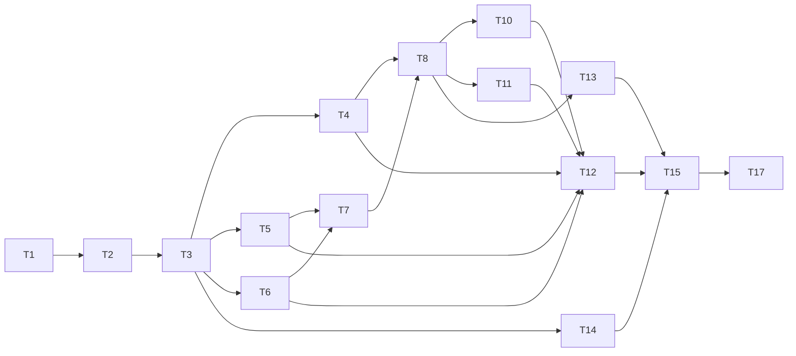

# Implementation Plan: Módulo 3 — Frontend

## Overview

Implementación del frontend de "Claro y Simple" con React + TypeScript, Vite, Tailwind CSS. El plan sigue un orden estricto: scaffolding → tipos y API → camino feliz end-to-end → errores → tests → refinamientos. Cada task produce código integrable incrementalmente.

## Task Dependency Graph



```json
{
  "waves": [
    { "wave": 0, "tasks": ["T1"] },
    { "wave": 1, "tasks": ["T2"] },
    { "wave": 2, "tasks": ["T3"] },
    { "wave": 3, "tasks": ["T4", "T5", "T6", "T14"] },
    { "wave": 4, "tasks": ["T7"] },
    { "wave": 5, "tasks": ["T8"] },
    { "wave": 6, "tasks": ["T10", "T11", "T13"] },
    { "wave": 7, "tasks": ["T12"] },
    { "wave": 8, "tasks": ["T15"] },
    { "wave": 9, "tasks": ["T17"] }
  ]
}
```

---

## Tasks

### Fase 1 — Scaffolding y configuración

- [x] 1. Inicializar proyecto Vite + React + TypeScript + Tailwind

  **Archivos**: `frontend/package.json`, `frontend/vite.config.ts`, `frontend/tsconfig.json`, `frontend/tailwind.config.ts`, `frontend/postcss.config.js`, `frontend/src/index.css`, `frontend/index.html`
  **Requisitos**: Req 11 (infraestructura del API Client), Tech Steering (strict mode, Vitest)
  **Descripción**: Ejecutar `npm create vite@latest` con template react-ts. Instalar y configurar Tailwind CSS (tailwind.config.ts, postcss.config.js, directivas @tailwind en index.css). Configurar tsconfig.json con `strict: true` y path aliases (`@/` → `src/`). Configurar Vitest en vite.config.ts con `@testing-library/react`, `@testing-library/user-event`, y `fast-check` como dependencias de dev. Crear estructura de carpetas: `src/components/`, `src/pages/`, `src/api/`, `src/types/`, `src/constants/`, `src/utils/`. Agregar scripts en package.json: `dev`, `build`, `test`, `lint`.
  **Criterio de completitud**: `npm run build` compila sin errores; `npm run test -- --run` ejecuta sin fallar (0 tests pero runner funciona); Tailwind genera utilidades en el bundle.

- [x] 2. Implementar tipos y constantes compartidas

  **Archivos**: `frontend/src/types/contract.ts`, `frontend/src/constants/errorMessages.ts`, `frontend/src/constants/categories.ts`, `frontend/src/utils/riskDisplay.ts`
  **Requisitos**: Req 4.1–4.10, Req 5.1–5.10, Req 6.2–6.5, Req 7.3, Req 7.7
  **Descripción**: Crear `src/types/contract.ts` con todos los tipos de interface-contracts.md (Clause, ClauseCategory, RiskLevel, AnalysisResult, IngestErrorCode, IngestSuccessResponse, IngestErrorResponse, IngestResponse, AnalyzeErrorCode, AnalyzeSuccessResponse, AnalyzeErrorResponse, AnalyzeResponse). Crear `src/constants/errorMessages.ts` con dos Records: `INGEST_ERROR_MESSAGES: Record<IngestErrorCode, string>` y `ANALYZE_ERROR_MESSAGES: Record<AnalyzeErrorCode, string>` con los 20 mensajes amigables exactos de los requisitos. Crear `src/constants/categories.ts` con el mapeo `CATEGORY_LABELS: Record<ClauseCategory, string>` (renovacion_automatica → "Renovación automática", etc.). Crear `src/utils/riskDisplay.ts` con la función `deriveRiskDisplay(clauses: Clause[])` que retorna `{ color, label, subtitle }` y una función `sortClausesByRisk(clauses: Clause[]): Clause[]` que ordena alto → medio → bajo.
  **Criterio de completitud**: TypeScript compila sin errores; los 20 error_codes tienen mapeo; `deriveRiskDisplay` cubre los 3 niveles + array vacío; `sortClausesByRisk` ordena correctamente.

### Fase 2 — API Client

- [x] 3. Implementar API Client

  **Archivos**: `frontend/src/api/client.ts`, `frontend/.env.example`
  **Requisitos**: Req 11.1–11.6
  **Descripción**: Implementar `uploadContract(file: File): Promise<IngestSuccessResponse>` que hace POST multipart/form-data a `${VITE_API_BASE_URL}/ingest` con header `x-api-key`. Implementar `analyzeContract(documentId: string): Promise<AnalyzeSuccessResponse>` que hace POST JSON a `${VITE_API_BASE_URL}/analyze` con header `x-api-key`. Para errores HTTP 4xx/5xx: parsear el body como `IngestErrorResponse` o `AnalyzeErrorResponse` y lanzar un error tipado que incluya el `error_code` y `message`. Para errores de red (fetch falla): lanzar error con mensaje "No se pudo conectar con el servidor. Verificá tu conexión a internet." Crear `.env.example` con `VITE_API_BASE_URL=http://localhost:3000` y `VITE_API_KEY=your-api-key-here`.
  **Criterio de completitud**: Las funciones están tipadas correctamente; errores HTTP se parsean como responses tipadas; errores de red producen mensaje genérico; `.env.example` documenta las variables necesarias.

### Fase 3 — Camino feliz

- [x] 4. Implementar UploadZone.tsx

  **Archivos**: `frontend/src/components/UploadZone.tsx`
  **Requisitos**: Req 1.1–1.5, Req 2.2
  **Descripción**: Componente con props `{ onFileSelected: (file: File) => void; disabled: boolean }`. Estado interno `idle | dragOver`. En idle: zona con instrucción de drag & drop y botón "Seleccionar archivo". En dragOver: borde coloreado y fondo highlight. Cuando disabled=true: deshabilitar toda interacción (opacity reducida, pointer-events none). Validación client-side al recibir archivo: si no es .pdf → mostrar "Solo se aceptan archivos en formato PDF" inline; si supera 10 MB → mostrar "El archivo supera el tamaño máximo permitido (10 MB)" inline; si es válido → llamar `onFileSelected(file)`. Estilos según Dirección Visual (espaciado generoso, fondo claro, transiciones sutiles).
  **Criterio de completitud**: Drag & drop funcional; file picker funcional; validaciones client-side muestran mensajes correctos; estado disabled bloquea interacción; estado dragOver muestra retroalimentación visual.

- [x] 5. Implementar RiskScore.tsx

  **Archivos**: `frontend/src/components/RiskScore.tsx`
  **Requisitos**: Req 6.1–6.5, Req 8.1–8.3
  **Descripción**: Componente con props `{ riskScore: number; clauses: Clause[] }`. Muestra el valor numérico prominente (ej: "75/100") con subtítulo "Puntaje acumulado". Usa `deriveRiskDisplay(clauses)` para determinar color y etiqueta. Aplica las clases Tailwind exactas de la paleta de riesgo (text-red-600, text-amber-500, text-green-600). Subtítulo bajo la etiqueta: "Basado en la cláusula más grave detectada". Caso clauses vacío: verde, "Riesgo bajo", subtítulo "No se detectaron cláusulas de riesgo".
  **Criterio de completitud**: Valor numérico visible; color y etiqueta correctos para alto/medio/bajo/vacío; subtítulos explicativos presentes; paleta exacta de Dirección Visual aplicada.

- [x] 6. Implementar ClauseCard.tsx y SuggestedQuestions.tsx

  **Archivos**: `frontend/src/components/ClauseCard.tsx`, `frontend/src/components/SuggestedQuestions.tsx`
  **Requisitos**: Req 7.1–7.6, Req 12.1–12.3
  **Descripción**: ClauseCard: props `{ clause: Clause }`. Renderiza clause_text como cita (estilo blockquote o con comillas), badge de categoría usando CATEGORY_LABELS en español, indicador visual de color por risk_level (paleta exacta: bg-red-50/border-red-600 para alto, bg-amber-50/border-amber-500 para medio, bg-green-50/border-green-600 para bajo), explanation como texto explicativo, suggested_question como pregunta sugerida. SuggestedQuestions: props `{ clauses: Clause[] }`. Filtra cláusulas con suggested_question no vacío. Renderiza lista de preguntas con badge de categoría asociado. Si clauses es vacío → retorna null.
  **Criterio de completitud**: ClauseCard muestra todos los campos con colores correctos; SuggestedQuestions lista preguntas con badge; SuggestedQuestions retorna null con array vacío.

- [x] 7. Implementar Results.tsx

  **Archivos**: `frontend/src/pages/Results.tsx`
  **Requisitos**: Req 6.1–6.5, Req 7.7, Req 8.1–8.3, Req 9.1–9.3, Req 10.1–10.3, Req 12.1–12.3
  **Descripción**: Página que recibe `AnalyzeSuccessResponse` vía state del router (o props). Secciones en orden: (1) nota de caché si cached=true ("Este resultado corresponde a un análisis previo del mismo documento") como info neutra, (2) summary_plain como resumen, (3) RiskScore con risk_score y clauses, (4) cláusulas ordenadas por risk_level (alto→medio→bajo) usando sortClausesByRisk, (5) SuggestedQuestions si hay cláusulas, (6) overall_recommendation diferenciada visualmente. Caso clauses vacío: mensaje positivo "No se encontraron cláusulas de riesgo en tu contrato" con ícono positivo, sin sección de preguntas, pero sí risk_score, summary_plain y overall_recommendation.
  **Criterio de completitud**: Todas las secciones renderizan en el orden correcto; nota de caché aparece solo cuando cached=true; cláusulas ordenadas por gravedad; caso vacío muestra mensaje positivo sin preguntas.

- [x] 8. Implementar Home.tsx con flujo completo y routing

  **Archivos**: `frontend/src/pages/Home.tsx`, `frontend/src/App.tsx`, `frontend/src/main.tsx`
  **Requisitos**: Req 1.5, Req 2.1–2.3, Req 3.1–3.3
  **Descripción**: Home.tsx con máquina de estados: idle → uploading → analyzing → success/error. En idle: muestra UploadZone habilitado. En uploading: spinner Tailwind (`animate-spin border-2 rounded-full w-6 h-6`) + "Subiendo tu contrato...", UploadZone disabled. En analyzing: spinner + "Analizando tu contrato... Esto puede tomar unos segundos", UploadZone disabled. Orquestación: onFileSelected → uploadContract(file) → si éxito: analyzeContract(documentId) → si éxito: navegar a Results con datos. Configurar React Router (react-router-dom) en App.tsx con rutas `/` (Home) y `/results` (Results). Main.tsx con BrowserRouter y render del App.
  **Criterio de completitud**: Flujo completo funcional idle→uploading→analyzing→results; estados de carga muestran mensajes correctos; navegación a Results pasa los datos; UploadZone se deshabilita durante carga.

- [x] 9. Checkpoint — Verificar camino feliz end-to-end

  **Archivos**: —
  **Requisitos**: Req 1–3, Req 6–10
  **Descripción**: Verificar manualmente que el flujo Home → upload → analyze → Results funciona con datos mockeados. Confirmar que los estados de carga se muestran, que Results renderiza todas las secciones, y que el caso de clauses vacío muestra el mensaje positivo. Si hay problemas, resolverlos antes de avanzar a la Fase 4.
  **Criterio de completitud**: El flujo end-to-end funciona sin errores de consola; todas las secciones de Results renderizan con datos de ejemplo.

### Fase 4 — Manejo de errores

- [x] 10. Implementar manejo de errores de ingesta

  **Archivos**: `frontend/src/pages/Home.tsx`
  **Requisitos**: Req 4.1–4.11
  **Descripción**: Cuando uploadContract falla con un error tipado que contiene error_code de IngestErrorCode: mapear a mensaje amigable usando INGEST_ERROR_MESSAGES. Renderizar el mensaje de error en Home con estilo de alerta. Mostrar botón "Intentar de nuevo" que vuelve al estado idle (el usuario puede seleccionar un nuevo archivo). Si el error es de red (sin error_code): mostrar "No se pudo conectar con el servidor. Verificá tu conexión a internet." con el mismo botón de retry.
  **Criterio de completitud**: Los 10 error_codes de ingesta muestran su mensaje correcto; botón "Intentar de nuevo" vuelve a idle; error de red muestra mensaje genérico.

- [x] 11. Implementar manejo de errores de análisis con retry diferenciado

  **Archivos**: `frontend/src/pages/Home.tsx`
  **Requisitos**: Req 5.1–5.11
  **Descripción**: Cuando analyzeContract falla con error_code de AnalyzeErrorCode: mapear a mensaje amigable usando ANALYZE_ERROR_MESSAGES. Clasificar errores: transitorios (MODEL_RESPONSE_INVALID, BEDROCK_TIMEOUT, BEDROCK_THROTTLED, BEDROCK_SERVICE_ERROR, PERSISTENCE_FAILURE, INTERNAL_ERROR) → botón "Intentar de nuevo" re-invoca analyzeContract(documentId) sin pasar por ingesta; errores de documento (MISSING_DOCUMENT_ID, INVALID_DOCUMENT_ID, DOCUMENT_NOT_FOUND, CONTEXT_TOO_LONG) → botón "Intentar de nuevo" vuelve a idle. Si error de red durante análisis: mensaje de conectividad con retry que re-invoca analyzeContract(documentId).
  **Criterio de completitud**: Los 10 error_codes de análisis muestran su mensaje correcto; errores transitorios hacen retry de analyze con el mismo document_id; errores de documento vuelven a idle; error de red permite retry de analyze.

### Fase 5 — Tests

- [ ]* 12. Tests unitarios de componentes (UploadZone, RiskScore, ClauseCard, SuggestedQuestions)

  **Archivos**: `frontend/src/components/__tests__/UploadZone.test.tsx`, `frontend/src/components/__tests__/RiskScore.test.tsx`, `frontend/src/components/__tests__/ClauseCard.test.tsx`, `frontend/src/components/__tests__/SuggestedQuestions.test.tsx`
  **Requisitos**: Req 1.1–1.5, Req 6.1–6.5, Req 7.1–7.6, Req 12.1–12.3
  **Descripción**: UploadZone: test de validación .pdf rechaza otros formatos, validación 10MB rechaza archivos grandes, estado dragOver aplica clases visuales, estado disabled bloquea interacción. RiskScore: derivación de color rojo con cláusula alto, amarillo con medio sin alto, verde con bajo o vacío, subtítulos correctos. ClauseCard: renderiza clause_text, category en español, color por risk_level, explanation, suggested_question. SuggestedQuestions: lista preguntas con badges, retorna null con array vacío.
  **Criterio de completitud**: Todos los tests pasan con `npm run test -- --run`; cobertura de los escenarios listados.

- [ ]* 13. Tests unitarios de páginas (Home, Results)

  **Archivos**: `frontend/src/pages/__tests__/Home.test.tsx`, `frontend/src/pages/__tests__/Results.test.tsx`
  **Requisitos**: Req 2.1–2.3, Req 3.1–3.3, Req 4.11, Req 5.11, Req 8.1–8.3, Req 9.1–9.3, Req 10.1–10.3
  **Descripción**: Home: flujo completo idle→uploading→analyzing→results con mocks del API Client; flujo con error de ingesta muestra mensaje y retry vuelve a idle; flujo con error de análisis transitorio hace retry con document_id; flujo con error de análisis de documento vuelve a idle. Results: renderizado de todas las secciones en orden correcto; nota de caché aparece solo cuando cached=true; caso clauses vacío muestra mensaje positivo sin preguntas sugeridas; cláusulas ordenadas por gravedad.
  **Criterio de completitud**: Todos los tests pasan; flujos de error cubren retry diferenciado; Results cubre caso vacío y caso con datos.

- [ ]* 14. Tests del API Client

  **Archivos**: `frontend/src/api/__tests__/client.test.ts`
  **Requisitos**: Req 11.1–11.6
  **Descripción**: Test de uploadContract con respuesta exitosa (HTTP 200) retorna IngestSuccessResponse. Test de analyzeContract con respuesta exitosa retorna AnalyzeSuccessResponse. Test de error HTTP de ingesta parsea correctamente IngestErrorResponse con error_code. Test de error HTTP de análisis parsea correctamente AnalyzeErrorResponse con error_code. Test de error de red (fetch rechazado) retorna mensaje de conectividad. Usar vi.fn() para mockear fetch global.
  **Criterio de completitud**: Todos los tests pasan; éxito y error cubiertos para ambos endpoints; error de red produce mensaje correcto.

- [ ]* 15. Property-based tests con fast-check

  **Archivos**: `frontend/src/__tests__/properties.test.ts`
  **Requisitos**: Req 4.1–4.10, Req 5.1–5.11, Req 6.2–6.5, Req 7.7, Req 12.1–12.3
  **Descripción**: Property 1 (deriveRiskDisplay): para cualquier array de Clause generado por fast-check, si al menos una tiene risk_level "alto" → retorna rojo, si ninguna alto pero alguna "medio" → retorna amber, si todas "bajo" o vacío → retorna green. Property 2 (exhaustividad de error_codes): para cada valor de IngestErrorCode y AnalyzeErrorCode (20 totales), el mapeo retorna string no vacío. Property 3 (retry transitorios): para cualquier error transitorio de análisis, la acción de retry reutiliza el document_id sin volver a idle. Property 4 (ordenamiento): para cualquier array de cláusulas con risk_levels mixtos, sortClausesByRisk produce un array donde todas las "alto" preceden a "medio" y todas las "medio" preceden a "bajo". Property 5 (preguntas sugeridas): para cualquier array de cláusulas, la cantidad de preguntas mostradas = cantidad de cláusulas con suggested_question no vacío.
  **Criterio de completitud**: Los 5 property tests pasan con mínimo 100 iteraciones cada uno; cada test referencia su propiedad del diseño.

- [x] 16. Checkpoint — Verificar que todos los tests pasan

  **Archivos**: —
  **Requisitos**: Todos
  **Descripción**: Correr `npm run test -- --run` y verificar que todos los tests unitarios y property-based pasan. Si hay fallos, resolverlos antes de avanzar a la Fase 6. Verificar que no hay warnings de TypeScript en la salida del build.
  **Criterio de completitud**: `npm run test -- --run` reporta 0 fallos; `npm run build` sin warnings de tipo.

### Fase 6 — Polish y baja prioridad

- [x] 17. Refinamientos finales

  **Archivos**: `frontend/index.html`, `frontend/.env.example`, `frontend/README.md`
  **Requisitos**: Tech Steering (strict mode, sin any injustificado)
  **Descripción**: Verificar responsividad básica (mobile-first con breakpoints sm/md/lg de Tailwind). Verificar que no hay warnings de TypeScript strict mode ni `any` sin comentario justificativo. Agregar meta tags básicos en index.html (title "Claro y Simple", description, viewport). Documentar en `.env.example` todas las variables necesarias. Crear README.md del frontend con instrucciones: instalación (`npm install`), desarrollo (`npm run dev`), tests (`npm run test`), build (`npm run build`).
  **Criterio de completitud**: `npm run build` sin warnings; sin `any` injustificado; meta tags presentes; README con instrucciones completas.

## Notes

- Tasks marcadas con `*` son opcionales y pueden omitirse para un MVP más rápido
- Cada task referencia requisitos específicos para trazabilidad
- Los checkpoints (tasks 9 y 16) aseguran validación incremental
- Los tipos en `frontend/src/types/contract.ts` son canónicos y definidos por interface-contracts.md — no inventar tipos adicionales
- La paleta de riesgo (text-red-600, text-amber-500, text-green-600) debe ser consistente entre RiskScore y ClauseCard
- El API Client lanza errores tipados que Home.tsx consume para mapear a mensajes amigables
- El retry diferenciado es la lógica más compleja: errores transitorios de análisis reusan document_id, errores de documento vuelven a idle
