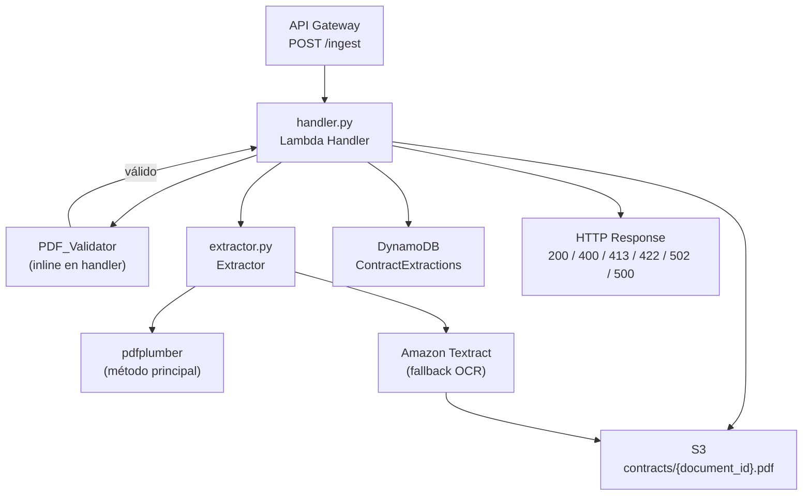
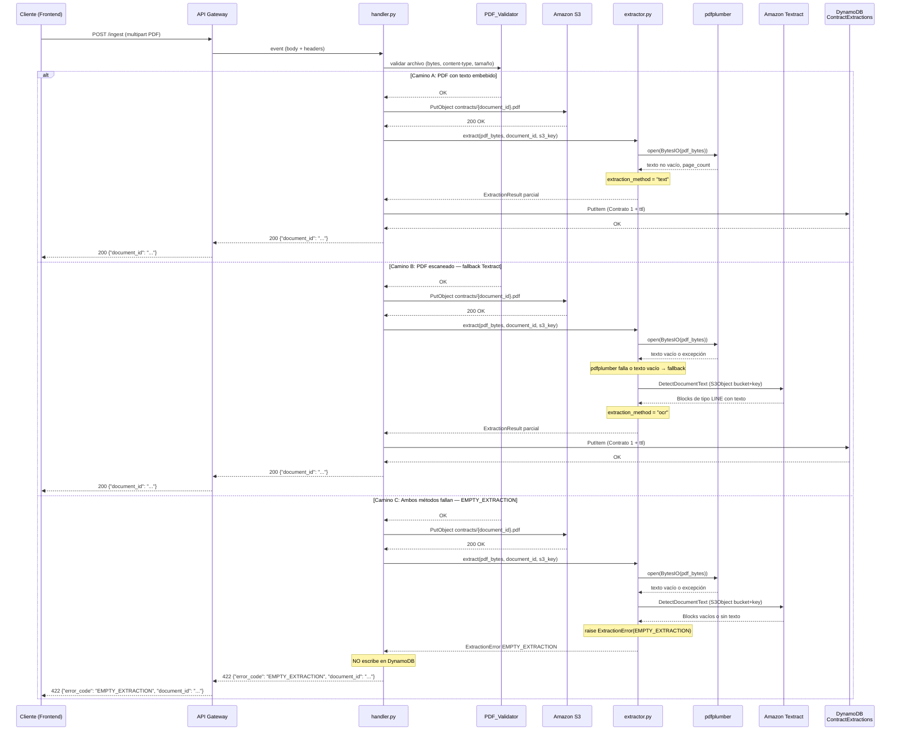

# Design

## Overview

Este documento describe el diseño técnico del Módulo 1 (Ingesta y Extracción) del proyecto **Claro y Simple**. Se basa en el `requirements.md` aprobado del módulo y en el **Contrato 1** definido en `interface-contracts.md`, que es la fuente de verdad para el schema de salida que consume el Módulo 2.

El módulo expone un único endpoint `POST /ingest` vía API Gateway. Recibe un PDF, lo valida, lo almacena en S3, extrae su texto (pdfplumber con fallback a Textract), genera un `document_id` UUID v4, persiste el resultado en DynamoDB `ContractExtractions` conforme al Contrato 1, y retorna `{ "document_id": "<uuid>" }` al llamador.

---

## Architecture

### Diagrama de componentes



### Rol de cada componente y archivo

| Archivo | Rol |
|---|---|
| `backend/ingestion/handler.py` | Punto de entrada Lambda. Parsea el evento de API Gateway, orquesta validación, S3, extracción y persistencia. Convierte excepciones de dominio a respuestas HTTP. |
| `backend/ingestion/extractor.py` | Lógica de extracción. Intenta pdfplumber; si falla o produce texto vacío, llama a Textract. Retorna `ExtractionResult` parcial (sin `metadata`). |
| `backend/ingestion/models.py` | Modelos Pydantic v2: `ExtractionMetadata`, `ExtractionResult`, enum `ExtractionMethod`, modelos del Contrato 3 (`IngestErrorCode`, `IngestSuccessResponse`, `IngestErrorResponse`), y helpers de serialización DynamoDB (`build_dynamodb_item`, `deserialize_dynamodb_item`). |
| `backend/shared/aws_utils.py` | Helper `get_boto3_client`. |
| `backend/shared/exceptions.py` | Excepciones de dominio: `ExtractionError`, `StorageError`, `ValidationError`, `ConfigurationError`. |

---

## Data Models

### `backend/ingestion/models.py`

```python
from __future__ import annotations

from datetime import datetime, timezone
from enum import Enum
from typing import Literal, Optional

from pydantic import BaseModel, Field, field_validator


class ExtractionMetadata(BaseModel):
    """Metadata del documento recibido. Forma parte del Contrato 1."""
    filename: str
    uploaded_at: datetime  # siempre UTC; se serializa a ISO 8601 con sufijo Z


class ExtractionResult(BaseModel):
    """
    Resultado de la extracción. Implementa el Contrato 1 definido en
    interface-contracts.md. Este objeto se persiste íntegramente en
    DynamoDB tabla ContractExtractions.

    El campo `ttl` NO forma parte del Contrato 1 pero es requerido por
    DynamoDB para el TTL de 24 horas. Se incluye en el ítem pero no se
    expone en la respuesta HTTP.
    """
    document_id: str = Field(
        pattern=r'^[0-9a-f]{8}-[0-9a-f]{4}-4[0-9a-f]{3}-[89ab][0-9a-f]{3}-[0-9a-f]{12}$'
    )
    raw_text: str = Field(min_length=1)
    extraction_method: Literal["text", "ocr"]
    page_count: int = Field(gt=0)
    metadata: ExtractionMetadata
    ttl: int  # Unix timestamp: now() + 86400 — campo extra para DynamoDB TTL

    @field_validator("raw_text")
    @classmethod
    def raw_text_not_whitespace_only(cls, v: str) -> str:
        if not v.strip():
            raise ValueError("raw_text no puede ser vacío ni contener únicamente espacios en blanco")
        return v
```
    document_id: str = Field(
        pattern=r'^[0-9a-f]{8}-[0-9a-f]{4}-4[0-9a-f]{3}-[89ab][0-9a-f]{3}-[0-9a-f]{12}$'
    )
    raw_text: str = Field(min_length=1)
    extraction_method: Literal["text", "ocr"]
    page_count: int = Field(gt=0)
    metadata: ExtractionMetadata
    ttl: int  # Unix timestamp: now() + 86400 — campo extra para DynamoDB TTL


def build_dynamodb_item(result: ExtractionResult) -> dict:
    """
    Serializa un ExtractionResult a un ítem DynamoDB (formato AttributeValue).

    Convierte:
    - `metadata.uploaded_at` (datetime) → string ISO 8601 con sufijo Z
    - `ttl` → número entero (N)
    - Todos los strings → tipo S
    - Todos los enteros → tipo N
    """
    uploaded_at_str: str
    if isinstance(result.metadata.uploaded_at, datetime):
        dt = result.metadata.uploaded_at
        if dt.tzinfo is None:
            dt = dt.replace(tzinfo=timezone.utc)
        uploaded_at_str = dt.strftime("%Y-%m-%dT%H:%M:%SZ")
    else:
        uploaded_at_str = str(result.metadata.uploaded_at)

    return {
        "document_id":        {"S": result.document_id},
        "raw_text":           {"S": result.raw_text},
        "extraction_method":  {"S": result.extraction_method},
        "page_count":         {"N": str(result.page_count)},
        "metadata": {
            "M": {
                "filename":    {"S": result.metadata.filename},
                "uploaded_at": {"S": uploaded_at_str},
            }
        },
        "ttl": {"N": str(result.ttl)},
    }
```

### `backend/shared/exceptions.py`

```python
from __future__ import annotations

from enum import Enum


# ---------------------------------------------------------------------------
# ExtractionError
# ---------------------------------------------------------------------------

class ExtractionErrorCode(str, Enum):
    EMPTY_EXTRACTION = "EMPTY_EXTRACTION"      # ambos métodos no produjeron texto
    TEXTRACT_FAILURE = "TEXTRACT_FAILURE"      # Textract lanzó excepción de servicio
    S3_OBJECT_NOT_FOUND = "S3_OBJECT_NOT_FOUND"  # objeto S3 no accesible para Textract


class ExtractionError(Exception):
    """Raised by Extractor when text extraction fails."""

    def __init__(self, error_code: ExtractionErrorCode, message: str) -> None:
        self.error_code = error_code
        self.message = message
        super().__init__(message)


# ---------------------------------------------------------------------------
# StorageError
# ---------------------------------------------------------------------------

class StorageErrorCode(str, Enum):
    STORAGE_FAILURE = "STORAGE_FAILURE"      # falla al subir el PDF a S3
    PERSISTENCE_FAILURE = "PERSISTENCE_FAILURE"  # falla al escribir en DynamoDB


class StorageError(Exception):
    """Raised by handler when S3 or DynamoDB operations fail."""

    def __init__(self, error_code: StorageErrorCode, message: str) -> None:
        self.error_code = error_code
        self.message = message
        super().__init__(message)


# ---------------------------------------------------------------------------
# ValidationError
# ---------------------------------------------------------------------------

class ValidationErrorCode(str, Enum):
    MISSING_FILE = "MISSING_FILE"
    INVALID_FILE_TYPE = "INVALID_FILE_TYPE"
    FILE_TOO_LARGE = "FILE_TOO_LARGE"


class ValidationError(Exception):
    """Raised by PDF_Validator when the uploaded file is invalid."""

    def __init__(self, error_code: ValidationErrorCode, message: str) -> None:
        self.error_code = error_code
        self.message = message
        super().__init__(message)


# ---------------------------------------------------------------------------
# ConfigurationError
# ---------------------------------------------------------------------------

class ConfigurationError(Exception):
    """Raised during module initialization when a required env var is missing."""

    def __init__(self, message: str) -> None:
        self.message = message
        super().__init__(message)
```

---

## Components and Interfaces

### Endpoint

```
POST /ingest
Content-Type: multipart/form-data
```

**Campo requerido**: `file` — archivo PDF (Content-Type: `application/pdf`).

### Respuestas

#### HTTP 200 — Éxito

```json
{
  "document_id": "3f6a1b2c-4d5e-4f7a-8b9c-0d1e2f3a4b5c"
}
```

#### HTTP 400 — Validación fallida

```json
{
  "error_code": "MISSING_FILE",
  "message": "No se recibió ningún archivo en el campo 'file'."
}
```

```json
{
  "error_code": "INVALID_FILE_TYPE",
  "message": "El archivo debe ser un PDF válido (Content-Type: application/pdf)."
}
```

#### HTTP 413 — Archivo demasiado grande

```json
{
  "error_code": "FILE_TOO_LARGE",
  "message": "El archivo supera el límite máximo de 10 MB."
}
```

#### HTTP 422 — Extracción fallida

```json
{
  "error_code": "EMPTY_EXTRACTION",
  "message": "El documento no contiene texto extraíble por ningún método.",
  "document_id": "3f6a1b2c-4d5e-4f7a-8b9c-0d1e2f3a4b5c"
}
```

#### HTTP 502 — Fallo de almacenamiento

```json
{
  "error_code": "STORAGE_FAILURE",
  "message": "No se pudo almacenar el archivo en S3."
}
```

```json
{
  "error_code": "PERSISTENCE_FAILURE",
  "message": "No se pudo persistir el resultado en DynamoDB."
}
```

#### HTTP 500 — Error inesperado

```json
{
  "error_code": "INTERNAL_ERROR",
  "message": "Error interno del servidor."
}
```

---

## Components and Interfaces — Diagramas de Secuencia

Los tres caminos se muestran en el mismo diagrama con bloques `alt`.



---

## Components and Interfaces — Diseño de Componentes

### 6.1 `handler.py`

La inicialización de configuración y clientes boto3 ocurre a nivel de **módulo** (fuera del handler), de modo que los errores de configuración se manifiestan en cold start y no en cada request.

```python
import base64
import json
import os
import uuid
from datetime import datetime, timezone

from aws_lambda_powertools import Logger
from shared.aws_utils import get_boto3_client
from shared.exceptions import (
    ConfigurationError, ExtractionError, StorageError, ValidationError,
    StorageErrorCode, ValidationErrorCode,
)
from ingestion.extractor import extract_text
from ingestion.models import ExtractionMetadata, ExtractionResult, build_dynamodb_item
from pydantic import ValidationError as PydanticValidationError

# ---------------------------------------------------------------------------
# Inicialización a nivel de módulo (cold start)
# ---------------------------------------------------------------------------

logger = Logger(service="ingestion")

# Leer variables requeridas — falla en cold start si alguna falta
_DYNAMODB_TABLE = os.environ.get("DYNAMODB_TABLE_NAME")
if not _DYNAMODB_TABLE:
    raise ConfigurationError("Variable de entorno requerida no definida: DYNAMODB_TABLE_NAME")

_S3_BUCKET = os.environ.get("S3_BUCKET_NAME")
if not _S3_BUCKET:
    raise ConfigurationError("Variable de entorno requerida no definida: S3_BUCKET_NAME")

_AWS_REGION = os.environ.get("AWS_REGION")
if not _AWS_REGION:
    raise ConfigurationError("Variable de entorno requerida no definida: AWS_REGION")

# Clientes boto3 — respetan AWS_ENDPOINT_URL si está definida (LocalStack)
_s3_client = get_boto3_client("s3")
_dynamodb_client = get_boto3_client("dynamodb")

MAX_FILE_SIZE_BYTES = 10 * 1024 * 1024  # 10 MB
PDF_MAGIC_BYTES = b"%PDF"


# ---------------------------------------------------------------------------
# Lambda handler
# ---------------------------------------------------------------------------

def lambda_handler(event: dict, context: object) -> dict:
    """
    Punto de entrada del Lambda de ingesta.

    Args:
        event: Evento de API Gateway (formato proxy integration).
        context: Contexto Lambda con aws_request_id.

    Returns:
        Dict con statusCode, headers y body serializado como JSON.
    """
    request_id = getattr(context, "aws_request_id", "local")
    logger.append_keys(request_id=request_id)

    document_id: str | None = None

    try:
        # 1. Parsear body multipart → bytes del PDF y filename
        pdf_bytes, filename = _parse_multipart(event)

        # 2. Validar PDF
        _validate_pdf(pdf_bytes, filename)

        # 3. Generar document_id
        document_id = str(uuid.uuid4())
        s3_key = f"contracts/{document_id}.pdf"

        # 4. Subir a S3
        _upload_to_s3(pdf_bytes, s3_key)

        # 5. Verificar objeto en S3 (Req. 2.3)
        _verify_s3_object(s3_key)

        # 6. Extraer texto
        uploaded_at = datetime.now(tz=timezone.utc)
        extraction = extract_text(
            pdf_bytes=pdf_bytes,
            document_id=document_id,
            s3_key=s3_key,
            s3_bucket=_S3_BUCKET,
        )

        # 7. Construir ExtractionResult completo — la validación Pydantic ocurre aquí
        try:
            result = ExtractionResult(
                document_id=document_id,
                raw_text=extraction.raw_text,
                extraction_method=extraction.extraction_method,
                page_count=extraction.page_count,
                metadata=ExtractionMetadata(
                    filename=filename[:255],
                    uploaded_at=uploaded_at,
                ),
                ttl=int(uploaded_at.timestamp()) + 86400,
            )
        except PydanticValidationError as exc:
            # Falla de validación de datos (patrón UUID inválido, extraction_method
            # no permitido, uploaded_at con formato incorrecto, etc.).
            # No es un error de infraestructura — no debe caer en el except genérico.
            logger.error(
                "Falla de validación al construir ExtractionResult",
                document_id=document_id,
                error=str(exc),
            )
            return _http_response(500, {
                "error_code": "VALIDATION_FAILURE",
                "message": "Error interno de validación de datos.",
            })

        # 8. Persistir en DynamoDB
        _persist_result(result)

        logger.info(
            "Extracción exitosa",
            document_id=document_id,
            extraction_method=result.extraction_method,
            page_count=result.page_count,
            filename=filename,
        )

        return _http_response(200, {"document_id": document_id})

    except ValidationError as exc:
        status = 413 if exc.error_code.value == "FILE_TOO_LARGE" else 400
        return _http_response(status, {"error_code": exc.error_code.value, "message": exc.message})

    except StorageError as exc:
        logger.error("StorageError", document_id=document_id, error_code=exc.error_code.value, message=exc.message)
        return _http_response(502, {"error_code": exc.error_code.value, "message": exc.message})

    except ExtractionError as exc:
        logger.warning("ExtractionError", document_id=document_id, error_code=exc.error_code.value, message=exc.message)
        body: dict = {"error_code": exc.error_code.value, "message": exc.message}
        if document_id and exc.error_code.value == "EMPTY_EXTRACTION":
            body["document_id"] = document_id
        return _http_response(422, body)

    except Exception as exc:
        logger.exception("Error inesperado", document_id=document_id)
        return _http_response(500, {"error_code": "INTERNAL_ERROR", "message": "Error interno del servidor."})
```

**Funciones auxiliares del handler:**

```python
def _parse_multipart(event: dict) -> tuple[bytes, str]:
    """Extrae los bytes del PDF y el filename del evento de API Gateway."""
    # API Gateway envía el body en base64 cuando isBase64Encoded = True
    body = event.get("body", "")
    if event.get("isBase64Encoded", False):
        body = base64.b64decode(body)
    # Parseo multipart: extraer campo 'file' y su Content-Disposition filename
    # Usa la librería `multipart` o parseo manual con headers del evento
    ...  # implementación detallada en la tarea de código

def _validate_pdf(pdf_bytes: bytes, filename: str) -> None:
    """Lanza ValidationError si el archivo no es un PDF válido o supera el límite."""
    if not pdf_bytes:
        raise ValidationError(ValidationErrorCode.MISSING_FILE, "No se recibió ningún archivo.")
    if len(pdf_bytes) > MAX_FILE_SIZE_BYTES:
        raise ValidationError(ValidationErrorCode.FILE_TOO_LARGE, "El archivo supera el límite de 10 MB.")
    if not pdf_bytes.startswith(PDF_MAGIC_BYTES):
        raise ValidationError(ValidationErrorCode.INVALID_FILE_TYPE, "El archivo debe ser un PDF válido.")

def _upload_to_s3(pdf_bytes: bytes, s3_key: str) -> None:
    """Sube el PDF a S3. Lanza StorageError si falla."""
    try:
        _s3_client.put_object(Bucket=_S3_BUCKET, Key=s3_key, Body=pdf_bytes, ContentType="application/pdf")
    except Exception as exc:
        raise StorageError(StorageErrorCode.STORAGE_FAILURE, f"Error al subir a S3: {exc}") from exc

def _persist_result(result: ExtractionResult) -> None:
    """Serializa ExtractionResult y escribe en DynamoDB. Lanza StorageError si falla."""
    try:
        item = build_dynamodb_item(result)
        _dynamodb_client.put_item(TableName=_DYNAMODB_TABLE, Item=item)
    except Exception as exc:
        raise StorageError(StorageErrorCode.PERSISTENCE_FAILURE, f"Error al escribir en DynamoDB: {exc}") from exc

def _http_response(status_code: int, body: dict) -> dict:
    """Formatea una respuesta HTTP compatible con API Gateway proxy integration."""
    return {
        "statusCode": status_code,
        "headers": {"Content-Type": "application/json"},
        "body": json.dumps(body, ensure_ascii=False),
    }
```

### 6.2 `extractor.py`

```python
from __future__ import annotations

import io
from dataclasses import dataclass

import pdfplumber
from aws_lambda_powertools import Logger

from shared.aws_utils import get_boto3_client
from shared.exceptions import ExtractionError, ExtractionErrorCode

logger = Logger(service="ingestion")

# Cliente Textract inicializado a nivel de módulo (respeta AWS_ENDPOINT_URL)
_textract_client = get_boto3_client("textract")


@dataclass
class _PartialExtraction:
    """Resultado intermedio antes de agregar metadata."""
    raw_text: str
    extraction_method: str   # "text" | "ocr"
    page_count: int


def extract_text(
    pdf_bytes: bytes,
    document_id: str,
    s3_key: str,
    s3_bucket: str,
) -> _PartialExtraction:
    """
    Extrae texto de un PDF. Intenta pdfplumber primero; si falla o produce
    texto vacío, usa Amazon Textract como fallback.

    Args:
        pdf_bytes: Contenido binario del PDF.
        document_id: UUID del documento (para logging).
        s3_key: Clave S3 donde el PDF ya fue almacenado (para Textract).
        s3_bucket: Nombre del bucket S3.

    Returns:
        _PartialExtraction con raw_text, extraction_method y page_count.

    Raises:
        ExtractionError: Si ambos métodos fallan o producen texto vacío.
    """
    # --- Intento 1: pdfplumber ---
    pdfplumber_failed = False
    try:
        text, page_count = _extract_with_pdfplumber(pdf_bytes, document_id)
        if text.strip():
            return _PartialExtraction(raw_text=text, extraction_method="text", page_count=page_count)
        else:
            logger.warning("pdfplumber produjo texto vacío, usando fallback Textract", document_id=document_id)
    except Exception as exc:
        logger.error("pdfplumber lanzó excepción", document_id=document_id, error=str(exc))
        pdfplumber_failed = True

    # --- Intento 2: Textract (fallback) ---
    return _extract_with_textract(s3_bucket, s3_key, document_id)


def _extract_with_pdfplumber(pdf_bytes: bytes, document_id: str) -> tuple[str, int]:
    """
    Abre el PDF desde memoria con pdfplumber.

    Returns:
        Tupla (texto_concatenado, page_count).
    """
    with pdfplumber.open(io.BytesIO(pdf_bytes)) as pdf:
        page_count = len(pdf.pages)
        pages_text = [page.extract_text() or "" for page in pdf.pages]
    return "\n".join(pages_text), page_count


def _extract_with_textract(s3_bucket: str, s3_key: str, document_id: str) -> _PartialExtraction:
    """
    Llama a Textract DetectDocumentText usando el objeto S3 ya subido.

    Returns:
        _PartialExtraction con extraction_method="ocr".

    Raises:
        ExtractionError: TEXTRACT_FAILURE, S3_OBJECT_NOT_FOUND, o EMPTY_EXTRACTION.
    """
    try:
        response = _textract_client.detect_document_text(
            Document={"S3Object": {"Bucket": s3_bucket, "Name": s3_key}}
        )
    except _textract_client.exceptions.InvalidS3ObjectException as exc:
        raise ExtractionError(ExtractionErrorCode.S3_OBJECT_NOT_FOUND, f"Objeto S3 no encontrado: {exc}") from exc
    except Exception as exc:
        logger.error("Textract lanzó excepción", document_id=document_id, error=str(exc))
        raise ExtractionError(ExtractionErrorCode.TEXTRACT_FAILURE, f"Error en Textract: {exc}") from exc

    # Parsear Blocks de tipo LINE
    blocks = response.get("Blocks", [])
    lines = [b["Text"] for b in blocks if b.get("BlockType") == "LINE" and b.get("Text")]
    raw_text = "\n".join(lines)

    if not raw_text.strip():
        raise ExtractionError(
            ExtractionErrorCode.EMPTY_EXTRACTION,
            "El documento no contiene texto extraíble por ningún método."
        )

    # Textract no reporta page_count directamente; contar PAGEs en Blocks
    page_count = len({b["Page"] for b in blocks if "Page" in b}) or 1

    return _PartialExtraction(raw_text=raw_text, extraction_method="ocr", page_count=page_count)
```

### 6.3 `models.py` (código completo listo para copiar)

Ver sección 3 — el código está definido allí de forma completa.

### 6.4 `backend/shared/aws_utils.py`

```python
from __future__ import annotations

import os

import boto3


def get_boto3_client(service_name: str):
    """
    Retorna un cliente boto3 apuntando a LocalStack si AWS_ENDPOINT_URL está definida.

    Si AWS_ENDPOINT_URL está presente en el entorno, se usa como endpoint_url.
    Si está ausente, boto3 usa los endpoints reales de AWS (comportamiento por defecto).
    """
    kwargs: dict = {}
    endpoint_url = os.getenv("AWS_ENDPOINT_URL")
    if endpoint_url:
        kwargs["endpoint_url"] = endpoint_url
    return boto3.client(service_name, **kwargs)
```

### 6.5 `backend/shared/exceptions.py`

Ver sección 3 — el código completo está definido allí.

---

## Error Handling

| Excepción | `error_code` | HTTP Status | Se persiste en DynamoDB | Nivel de log |
|---|---|---|---|---|
| `ValidationError` | `MISSING_FILE` | 400 | No | WARNING |
| `ValidationError` | `INVALID_FILE_TYPE` | 400 | No | WARNING |
| `ValidationError` | `FILE_TOO_LARGE` | 413 | No | WARNING |
| `StorageError` | `STORAGE_FAILURE` | 502 | No (S3 falló antes de la extracción) | ERROR |
| `StorageError` | `PERSISTENCE_FAILURE` | 502 | No (put_item falló por motivo de infraestructura: red, permisos, throttling) | ERROR |
| `PydanticValidationError` | `VALIDATION_FAILURE` | 500 | No (nunca llega a put_item) | ERROR |
| `ExtractionError` | `EMPTY_EXTRACTION` | 422 | **No** | WARNING |
| `ExtractionError` | `TEXTRACT_FAILURE` | 422 | **No** | ERROR |
| `ExtractionError` | `S3_OBJECT_NOT_FOUND` | 422 | **No** | ERROR |
| `ConfigurationError` | — | 500 (cold start) | No | CRITICAL (cold start) |
| Excepción no esperada | `INTERNAL_ERROR` | 500 | No | ERROR (con traceback) |

**Invariante**: ningún registro con `raw_text` vacío o con datos inválidos es persistido en `ContractExtractions`. `PERSISTENCE_FAILURE` se reserva exclusivamente para fallas de infraestructura en `put_item` (red, permisos, throttling de DynamoDB). `VALIDATION_FAILURE` cubre fallas de validación de datos antes de que se intente la escritura.

---

## Correctness Properties

Estas son las propiedades que el diseño garantiza y que las tasks de implementación deben preservar:

### Property 1: No persistencia de datos inválidos

**Validates: Requirements 5.4, 6.4, 7.2, 8.1, 8.3, 8.5**

Ningún `ExtractionResult` con `raw_text` vacío (o que falle cualquier otra validación de Pydantic) puede llegar a escribirse en `ContractExtractions`. Todo camino de fallo (validación, extracción, o construcción del modelo) retorna un error HTTP antes de invocar `put_item`.

### Property 2: Conformidad exacta con el Contrato 1

**Validates: Requirements 8.1, 8.2, 8.3, 8.4, 8.5**

Todo ítem persistido cumple simultáneamente: `document_id` con patrón UUID v4, `extraction_method` ∈ {`"text"`, `"ocr"`}, `page_count` entero ≥ 1, y `metadata.uploaded_at` en formato ISO 8601 UTC con sufijo `Z`.

### Property 3: Equivalencia funcional entre entornos

**Validates: Requirements 10.4, 10.5, 10.6, 10.8**

La lógica de negocio (validación, extracción, persistencia) es idéntica en `localstack`, `development` y `production`. El entorno solo determina la inicialización de clientes boto3 (`endpoint_url` presente o ausente) y la fuente de configuración (`.env` vs. SSM Parameter Store) — nunca el comportamiento del flujo de procesamiento.

### Property 4: Round-trip sin pérdida

**Validates: Requirements 8.6**

Serializar un `ExtractionResult` a ítem de DynamoDB (`build_dynamodb_item`) y deserializarlo de vuelta preserva todos los campos del Contrato 1 (`document_id`, `raw_text`, `extraction_method`, `page_count`, `metadata.filename`, `metadata.uploaded_at`) sin pérdida ni transformación de datos. Verificado por property-based testing en la sección de Testing Strategy.

---

## Components and Interfaces — Configuración

### Variables requeridas

| Variable | Descripción | Requerida en |
|---|---|---|
| `DYNAMODB_TABLE_NAME` | Nombre de la tabla DynamoDB (`ContractExtractions`) | Todos los entornos |
| `S3_BUCKET_NAME` | Nombre del bucket S3 (`claro-y-simple-contracts`) | Todos los entornos |
| `AWS_REGION` | Región AWS (`us-east-1`) | Todos los entornos |
| `ENVIRONMENT` | Modo del entorno: `localstack` / `development` / `production` | Todos los entornos |
| `AWS_ENDPOINT_URL` | URL de LocalStack (`http://localhost:4566`) | Solo `localstack` |
| `LOG_LEVEL` | Nivel de log (`INFO` por defecto, `DEBUG` para trazas) | Opcional, todos |

### Cómo se leen

Las variables se leen a **nivel de módulo**, antes de la definición de `lambda_handler`. Esto garantiza que un valor faltante provoca una excepción `ConfigurationError` en cold start, no en tiempo de request:

```python
# module scope — ejecutado en cold start
_DYNAMODB_TABLE = os.environ.get("DYNAMODB_TABLE_NAME")
if not _DYNAMODB_TABLE:
    raise ConfigurationError("Variable de entorno requerida no definida: DYNAMODB_TABLE_NAME")

_S3_BUCKET = os.environ.get("S3_BUCKET_NAME")
if not _S3_BUCKET:
    raise ConfigurationError("Variable de entorno requerida no definida: S3_BUCKET_NAME")

_AWS_REGION = os.environ.get("AWS_REGION")
if not _AWS_REGION:
    raise ConfigurationError("Variable de entorno requerida no definida: AWS_REGION")
```

### Los tres modos de entorno

| `ENVIRONMENT` | Clientes boto3 | Fuente de configuración |
|---|---|---|
| `localstack` | Con `endpoint_url=AWS_ENDPOINT_URL` | `.env` local |
| `development` (o ausente) | Sin `endpoint_url` (AWS real) | `.env` local |
| `production` | Sin `endpoint_url` (AWS real) | SSM Parameter Store |

La lógica de negocio es **idéntica** en los tres modos. Solo varía la inicialización de clientes y la fuente de configuración, gestionada por `get_boto3_client`.

### Archivo `.env` para modo `localstack`

```dotenv
ENVIRONMENT=localstack
AWS_ENDPOINT_URL=http://localhost:4566
AWS_DEFAULT_REGION=us-east-1
AWS_ACCESS_KEY_ID=test
AWS_SECRET_ACCESS_KEY=test
DYNAMODB_TABLE_NAME=ContractExtractions
S3_BUCKET_NAME=claro-y-simple-contracts
LOG_LEVEL=DEBUG
```

---

## Testing Strategy

### 9.1 Tests unitarios

**Archivos**: `backend/ingestion/tests/test_extractor.py`, `backend/ingestion/tests/test_handler.py`

**Qué se mockea**: S3, DynamoDB y Textract se mockean siempre en tests unitarios, usando `unittest.mock.patch` o `moto`.

**Nota crítica**: Textract **no está disponible en LocalStack Community**. Textract SIEMPRE se mockea, incluso en tests de integración.

#### Fixtures de PDFs en `tests/fixtures/`

| Archivo | Propósito |
|---|---|
| `sample_text.pdf` | PDF con texto embebido — prueba camino A (pdfplumber exitoso) |
| `sample_scanned.pdf` | PDF escaneado (imagen) — prueba camino B (Textract fallback) |
| `sample_empty.pdf` | PDF válido pero sin texto extraíble — prueba camino C (EMPTY_EXTRACTION) |
| `sample_corrupted.pdf` | PDF con bytes inválidos — prueba manejo de excepción de pdfplumber |
| `sample_large.pdf` | PDF mayor a 10 MB — prueba validación FILE_TOO_LARGE |

#### Casos de prueba clave — `test_extractor.py`

```python
# Caso A: pdfplumber extrae texto correctamente
def test_extract_text_pdfplumber_success(mock_s3):
    pdf_bytes = open("fixtures/sample_text.pdf", "rb").read()
    result = extract_text(pdf_bytes, "test-uuid", "contracts/test.pdf", "test-bucket")
    assert result.extraction_method == "text"
    assert len(result.raw_text.strip()) > 0
    assert result.page_count > 0

# Caso B: pdfplumber vacío → Textract retorna texto
def test_extract_text_textract_fallback(mock_s3, mock_textract_success):
    pdf_bytes = open("fixtures/sample_scanned.pdf", "rb").read()
    result = extract_text(pdf_bytes, "test-uuid", "contracts/test.pdf", "test-bucket")
    assert result.extraction_method == "ocr"
    assert len(result.raw_text.strip()) > 0

# Caso C: ambos fallan → EMPTY_EXTRACTION
def test_extract_text_empty_raises(mock_s3, mock_textract_empty):
    pdf_bytes = open("fixtures/sample_empty.pdf", "rb").read()
    with pytest.raises(ExtractionError) as exc_info:
        extract_text(pdf_bytes, "test-uuid", "contracts/test.pdf", "test-bucket")
    assert exc_info.value.error_code == ExtractionErrorCode.EMPTY_EXTRACTION

# Textract falla con excepción → TEXTRACT_FAILURE
def test_extract_text_textract_failure(mock_s3, mock_textract_exception):
    with pytest.raises(ExtractionError) as exc_info:
        extract_text(b"%PDF...", "test-uuid", "contracts/test.pdf", "test-bucket")
    assert exc_info.value.error_code == ExtractionErrorCode.TEXTRACT_FAILURE
```

#### Casos de prueba clave — `test_handler.py`

```python
# Sin archivo → 400 MISSING_FILE
def test_handler_missing_file(lambda_context):
    event = {"body": "", "isBase64Encoded": False}
    response = lambda_handler(event, lambda_context)
    assert response["statusCode"] == 400
    assert json.loads(response["body"])["error_code"] == "MISSING_FILE"

# Archivo muy grande → 413 FILE_TOO_LARGE
def test_handler_file_too_large(lambda_context):
    ...

# S3 falla → 502 STORAGE_FAILURE
def test_handler_s3_failure(lambda_context, mock_s3_failure):
    ...

# Flujo completo exitoso → 200 con document_id
def test_handler_success_text_extraction(lambda_context, mock_s3, mock_dynamodb):
    ...

# EMPTY_EXTRACTION → 422, sin escribir en DynamoDB
def test_handler_empty_extraction_no_dynamo_write(lambda_context, mock_s3, mock_textract_empty, mock_dynamodb):
    response = lambda_handler(build_event("fixtures/sample_empty.pdf"), lambda_context)
    assert response["statusCode"] == 422
    mock_dynamodb.put_item.assert_not_called()
```

### 9.2 Tests de integración

**Archivo**: `backend/ingestion/tests/test_integration.py`

**Precondición obligatoria**: el script `scripts/setup-localstack.sh` debe haberse ejecutado con el container de LocalStack activo antes de correr estos tests. El container arranca vacío; el script crea el bucket S3, la lifecycle policy y las tablas DynamoDB con TTL.

```bash
# 1. Levantar LocalStack
docker run --rm -d -p 4566:4566 localstack/localstack

# 2. Bootstrap de recursos
./scripts/setup-localstack.sh

# 3. Correr tests de integración
cd backend/ingestion
ENVIRONMENT=localstack pytest tests/test_integration.py -v
```

**Servicios reales vs. mockeados:**

| Servicio | Tests de integración |
|---|---|
| S3 (LocalStack) | **Real** — `claro-y-simple-contracts` |
| DynamoDB (LocalStack) | **Real** — `ContractExtractions` |
| Textract | **Siempre mockeado** (no disponible en LocalStack Community) |

**Qué verifican los tests de integración:**

```python
# Flujo completo camino A: escribe en S3 real + DynamoDB real
def test_integration_full_flow_text_extraction(mock_textract):
    # 1. Invocar handler con PDF de texto embebido
    response = lambda_handler(build_event("fixtures/sample_text.pdf"), ctx)
    assert response["statusCode"] == 200
    document_id = json.loads(response["body"])["document_id"]

    # 2. Verificar objeto en S3 real
    s3 = get_boto3_client("s3")
    obj = s3.head_object(Bucket=S3_BUCKET, Key=f"contracts/{document_id}.pdf")
    assert obj["ResponseMetadata"]["HTTPStatusCode"] == 200

    # 3. Verificar ítem en DynamoDB real (Contrato 1)
    dynamo = get_boto3_client("dynamodb")
    item = dynamo.get_item(
        TableName=DYNAMODB_TABLE,
        Key={"document_id": {"S": document_id}}
    )["Item"]
    assert item["extraction_method"]["S"] == "text"
    assert len(item["raw_text"]["S"].strip()) > 0
    assert int(item["page_count"]["N"]) > 0
    assert "ttl" in item

# Verificar conformidad del Contrato 1 (round-trip)
def test_integration_contract1_roundtrip(mock_textract):
    response = lambda_handler(build_event("fixtures/sample_text.pdf"), ctx)
    document_id = json.loads(response["body"])["document_id"]
    item = _get_dynamo_item(document_id)
    # Deserializar y validar con el modelo Pydantic
    result = _deserialize_item_to_extraction_result(item)
    assert result.document_id == document_id
    assert result.raw_text  # no vacío
    assert result.extraction_method in ("text", "ocr")
    assert result.page_count >= 1
```

### 9.3 Property-Based Testing con Hypothesis

```python
from hypothesis import given, strategies as st
from hypothesis.strategies import builds

# Propiedad 1: round-trip ExtractionResult → DynamoDB item → deserializado
# El objeto original y el deserializado deben ser idénticos en todos los campos del Contrato 1
@given(
    raw_text=st.text(min_size=1).filter(lambda t: t.strip()),
    page_count=st.integers(min_value=1, max_value=500),
    extraction_method=st.sampled_from(["text", "ocr"]),
)
def test_property_extraction_result_roundtrip(raw_text, page_count, extraction_method):
    result = ExtractionResult(
        document_id=str(uuid.uuid4()),
        raw_text=raw_text,
        extraction_method=extraction_method,
        page_count=page_count,
        metadata=ExtractionMetadata(filename="test.pdf", uploaded_at=datetime.now(timezone.utc)),
        ttl=int(datetime.now(timezone.utc).timestamp()) + 86400,
    )
    item = build_dynamodb_item(result)
    deserialized = deserialize_dynamodb_item(item)
    assert deserialized["document_id"] == result.document_id
    assert deserialized["raw_text"] == result.raw_text
    assert deserialized["extraction_method"] == result.extraction_method
    assert deserialized["page_count"] == result.page_count
    assert deserialized["metadata"]["filename"] == result.metadata.filename

# Propiedad 2: invariante raw_text — ningún ExtractionResult con raw_text vacío
# puede construirse exitosamente (Pydantic debe rechazarlo)
@given(raw_text=st.just("") | st.just("   ") | st.just("\n"))
def test_property_empty_raw_text_rejected(raw_text):
    with pytest.raises(Exception):  # ValidationError de Pydantic
        ExtractionResult(
            document_id=str(uuid.uuid4()),
            raw_text=raw_text,
            extraction_method="text",
            page_count=1,
            metadata=ExtractionMetadata(filename="x.pdf", uploaded_at=datetime.now(timezone.utc)),
            ttl=9999999999,
        )
```

---

## Components and Interfaces — Infraestructura SAM

### Recurso Lambda en `infra/template.yaml`

```yaml
IngestionFunction:
  Type: AWS::Serverless::Function
  Properties:
    Handler: handler.lambda_handler
    Runtime: python3.12
    CodeUri: ../backend/ingestion/
    Timeout: 30           # Textract puede tardar varios segundos en PDFs grandes
    MemorySize: 512       # pdfplumber necesita memoria para cargar el PDF en memoria
    Environment:
      Variables:
        DYNAMODB_TABLE_NAME: !Ref ContractExtractionsTable
        S3_BUCKET_NAME: !Ref ContractsBucket
        AWS_REGION: !Ref AWS::Region
        ENVIRONMENT: !Ref EnvironmentName
        LOG_LEVEL: INFO
    Policies:
      - S3WritePolicy:
          BucketName: !Ref ContractsBucket
      - S3ReadPolicy:
          BucketName: !Ref ContractsBucket
      - DynamoDBWritePolicy:
          TableName: !Ref ContractExtractionsTable
      - Statement:
          - Effect: Allow
            Action:
              - textract:DetectDocumentText
            Resource: "*"
    Events:
      IngestApi:
        Type: Api
        Properties:
          Path: /ingest
          Method: POST
          RestApiId: !Ref ClaroYSimpleApi
```

### Permisos IAM necesarios

| Acción | Recurso | Justificación |
|---|---|---|
| `s3:PutObject` | `claro-y-simple-contracts/contracts/*` | Subir el PDF |
| `s3:HeadObject` | `claro-y-simple-contracts/contracts/*` | Verificar que el objeto existe (Req. 2.3) |
| `dynamodb:PutItem` | `ContractExtractions` | Persistir el ExtractionResult |
| `textract:DetectDocumentText` | `*` (Textract no acepta ARN de recurso específico) | Fallback OCR |

### Recursos referenciados (ya definidos por `setup-localstack.sh`)

- **Bucket S3**: `claro-y-simple-contracts` con lifecycle policy de 24h sobre el prefijo `contracts/`
- **Tabla DynamoDB**: `ContractExtractions` (on-demand, clave de partición `document_id`, TTL sobre atributo `ttl` = 24h)

### Parámetros SAM recomendados

```yaml
Parameters:
  EnvironmentName:
    Type: String
    Default: development
    AllowedValues:
      - localstack
      - development
      - production
```

El parámetro `EnvironmentName` se pasa como variable de entorno `ENVIRONMENT` al Lambda, permitiendo que el handler detecte el modo de operación sin cambios de código.