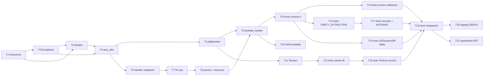

# Implementation Plan: Módulo 1 — Ingesta y Extracción

## Overview

Este plan implementa el Módulo 1 (Ingesta y Extracción) de Claro y Simple en 21 tasks, siguiendo `design.md` y `requirements.md` ya aprobados. El orden está deliberadamente priorizado por riesgo de demo, no por orden de archivo: primero la infraestructura base y modelos (Fase 1), después el camino feliz completo con pdfplumber (Fase 2), después el fallback a Textract (Fase 3), después los casos de error uno por uno (Fase 4), después los tests de integración contra LocalStack (Fase 5) y la infraestructura SAM (Fase 6). La Fase 7 (property-based testing con Hypothesis y logging DEBUG condicional) queda al final a propósito: es lo primero que se recorta si el tiempo apremia antes de la demo, sin comprometer el flujo principal.

## Task Dependency Graph



```json
{
  "waves": [
    { "wave": 1,  "tasks": ["T1"] },
    { "wave": 2,  "tasks": ["T2"] },
    { "wave": 3,  "tasks": ["T3"] },
    { "wave": 4,  "tasks": ["T4"] },
    { "wave": 5,  "tasks": ["T5", "T6"] },
    { "wave": 6,  "tasks": ["T7", "T11"] },
    { "wave": 7,  "tasks": ["T8", "T12"] },
    { "wave": 8,  "tasks": ["T9", "T16"] },
    { "wave": 9,  "tasks": ["T10", "T19"] },
    { "wave": 10, "tasks": ["T13", "T14", "T15"] },
    { "wave": 11, "tasks": ["T17"] },
    { "wave": 12, "tasks": ["T18"] },
    { "wave": 13, "tasks": ["T20", "T21"] }
  ]
}
```

Las tasks dentro de la misma wave no tienen dependencia entre sí según el grafo de arriba; el número de wave es simplemente el nivel más profundo de sus dependencias + 1. Esto es informativo para entender qué tan paralelizable es el trabajo — no cambia el orden secuencial recomendado más abajo, pensado para una sola persona implementando de punta a punta.

---

## Tasks

### Fase 1 — Infraestructura base y modelos

- [x] 1. Crear estructura de carpetas y requirements.txt

  **Archivos**: `backend/ingestion/__init__.py`, `backend/ingestion/requirements.txt`, `backend/shared/__init__.py`, `backend/ingestion/tests/__init__.py`, `backend/ingestion/tests/fixtures/.gitkeep`, `backend/ingestion/.env.example`
  **Requisitos**: Req 10
  **Descripción**: Crear los paquetes Python del módulo con `__init__.py` vacíos. Crear `requirements.txt` con las dependencias de producción (pydantic>=2.0, aws-lambda-powertools, boto3, pdfplumber, python-multipart) y de desarrollo/test (pytest, moto[s3,dynamodb,textract], hypothesis). Crear `.env.example` con todas las variables de la sección 8 del design.md documentadas pero sin valores reales.
  **Criterio de completitud**: `python -m pytest --collect-only` no da ImportError en `backend/ingestion`.

- [x] 2. Implementar `backend/shared/exceptions.py`

  **Archivos**: `backend/shared/exceptions.py`
  **Requisitos**: Req 11
  **Descripción**: Implementar exactamente las clases del design.md sección 3: `ExtractionErrorCode` (EMPTY_EXTRACTION, TEXTRACT_FAILURE, S3_OBJECT_NOT_FOUND), `ExtractionError`, `StorageErrorCode` (STORAGE_FAILURE, PERSISTENCE_FAILURE), `StorageError`, `ValidationErrorCode` (MISSING_FILE, INVALID_FILE_TYPE, FILE_TOO_LARGE, VALIDATION_FAILURE), `ValidationError`, `ConfigurationError`. Todos con type hints completos y docstrings.
  **Criterio de completitud**: `from shared.exceptions import ExtractionError, StorageError, ValidationError, ConfigurationError` no lanza error; cada clase tiene su enum de `error_code`.

- [x] 3. Implementar `backend/ingestion/models.py`

  **Archivos**: `backend/ingestion/models.py`
  **Requisitos**: Req 7, Req 8, Contrato 1, Contrato 3
  **Descripción**: Implementar en un único archivo todos los modelos de ambas fuentes. Del design.md sección 3: `ExtractionMethod` (enum TEXT/OCR), `ExtractionMetadata` (filename: str, uploaded_at: datetime), `ExtractionResult` (document_id con pattern UUID v4, raw_text con min_length=1, extraction_method Literal, page_count Field(gt=0), metadata, ttl: int). Del Contrato 3 de interface-contracts.md: `IngestErrorCode` (enum con los 10 valores), `IngestSuccessResponse` (document_id: str), `IngestErrorResponse` (error_code: IngestErrorCode, message: str, document_id: Optional[str] = None). Todos los modelos en el mismo archivo, sin duplicaciones.
  **Criterio de completitud**: `ExtractionResult(document_id="not-a-uuid", ...)` lanza ValidationError de Pydantic; `ExtractionResult(raw_text="", ...)` lanza ValidationError de Pydantic; `IngestErrorCode.EMPTY_EXTRACTION.value == "EMPTY_EXTRACTION"` es True.

- [x] 4. Implementar `backend/shared/aws_utils.py` y `backend/ingestion/models.py`

  **Archivos**: `backend/shared/aws_utils.py`, `backend/ingestion/models.py`
  **Requisitos**: Req 10
  **Descripción**: Implementar `get_boto3_client(service_name: str)` en `backend/shared/aws_utils.py` que lee `AWS_ENDPOINT_URL` del entorno y lo pasa como `endpoint_url` si está presente, omite el parámetro si no lo está. Implementar `build_dynamodb_item(result: ExtractionResult) -> dict` en `backend/ingestion/models.py` que serializa al formato AttributeValue de DynamoDB: strings como `{"S": value}`, enteros como `{"N": str(value)}`, el campo `metadata` como `{"M": {...}}`, y `uploaded_at` convertido de datetime a string `YYYY-MM-DDTHH:MM:SSZ` con UTC garantizado.
  **Criterio de completitud**: Con `AWS_ENDPOINT_URL=http://localhost:4566` en el entorno, `get_boto3_client("s3")` retorna cliente con endpoint configurado; `build_dynamodb_item` produce dict con todas las claves del Contrato 1 en formato AttributeValue.

---

### Fase 2 — Camino feliz (Camino A: pdfplumber exitoso)

- [x] 5. Implementar extracción con pdfplumber en `extractor.py`

  **Archivos**: `backend/ingestion/extractor.py`
  **Requisitos**: Req 3
  **Descripción**: Crear el dataclass `_PartialExtraction` (raw_text, extraction_method, page_count). Implementar `_extract_with_pdfplumber(pdf_bytes: bytes, document_id: str) -> tuple[str, int]`: abrir desde `BytesIO`, extraer texto por página con `page.extract_text() or ""`, concatenar con `\n`, retornar (texto, page_count). Implementar `extract_text(pdf_bytes, document_id, s3_key, s3_bucket) -> _PartialExtraction` con solo el camino pdfplumber por ahora: si texto.strip() es no vacío retornar con extraction_method="text"; si vacío o excepción, loggear y dejar espacio para el fallback (que se agrega en Task 11). Inicializar cliente Textract a nivel de módulo.
  **Criterio de completitud**: Con `sample_text.pdf`, `extract_text(...)` retorna `_PartialExtraction` con `extraction_method="text"` y `raw_text` no vacío.

- [x] 6. Implementar validación PDF y parseo multipart en `handler.py`

  **Archivos**: `backend/ingestion/handler.py`
  **Requisitos**: Req 1, Req 10
  **Descripción**: Inicialización module-scope: leer `DYNAMODB_TABLE_NAME`, `S3_BUCKET_NAME`, `AWS_REGION` con `os.environ.get` y `if not` raise `ConfigurationError`; inicializar `_s3_client` y `_dynamodb_client` con `get_boto3_client`. Definir constantes `MAX_FILE_SIZE_BYTES = 10 * 1024 * 1024` y `PDF_MAGIC_BYTES = b"%PDF"`. Implementar `_parse_multipart(event)`: decodificar base64 si `isBase64Encoded`, parsear con `python-multipart` para extraer bytes y filename del campo `file`. Implementar `_validate_pdf(pdf_bytes, filename)`: raise `ValidationError(MISSING_FILE)` si vacío, raise `ValidationError(FILE_TOO_LARGE)` si supera 10 MB, raise `ValidationError(INVALID_FILE_TYPE)` si no comienza con `%PDF`. Importar `PydanticValidationError` con alias.
  **Criterio de completitud**: Llamar `_validate_pdf(b"", "")` lanza `ValidationError` con `error_code == ValidationErrorCode.MISSING_FILE`; llamar con bytes que no comienzan con `%PDF` lanza `INVALID_FILE_TYPE`; llamar con 11 MB lanza `FILE_TOO_LARGE`.

- [x] 7. Implementar operaciones S3 en `handler.py`

  **Archivos**: `backend/ingestion/handler.py`
  **Requisitos**: Req 2
  **Descripción**: Implementar `_upload_to_s3(pdf_bytes: bytes, s3_key: str) -> None`: llamar `_s3_client.put_object` con bucket `_S3_BUCKET`, key `s3_key`, body y `ContentType="application/pdf"`; capturar cualquier excepción y re-lanzar como `StorageError(STORAGE_FAILURE, ...)`. Implementar `_verify_s3_object(s3_key: str) -> None`: llamar `_s3_client.head_object`; capturar excepción y re-lanzar como `StorageError(STORAGE_FAILURE, ...)`.
  **Criterio de completitud**: Con mock S3 que lanza `ClientError`, `_upload_to_s3(...)` lanza `StorageError` con `error_code == StorageErrorCode.STORAGE_FAILURE`.

- [x] 8. Implementar persistencia DynamoDB y formato de respuesta HTTP en `handler.py`

  **Archivos**: `backend/ingestion/handler.py`
  **Requisitos**: Req 7
  **Descripción**: Implementar `_persist_result(result: ExtractionResult) -> None`: llamar `build_dynamodb_item`, luego `_dynamodb_client.put_item`; capturar cualquier excepción y re-lanzar como `StorageError(PERSISTENCE_FAILURE, ...)`. Implementar `_http_response(status_code: int, body: dict) -> dict`: retornar dict con `statusCode`, `headers: {"Content-Type": "application/json"}`, `body: json.dumps(body, ensure_ascii=False)`.
  **Criterio de completitud**: Con mock DynamoDB que lanza `ClientError`, `_persist_result(...)` lanza `StorageError` con `error_code == StorageErrorCode.PERSISTENCE_FAILURE`; `_http_response(200, {"document_id": "x"})` retorna dict con `statusCode == 200` y body parseable.

- [x] 9. Integrar `lambda_handler` — camino feliz completo

  **Archivos**: `backend/ingestion/handler.py`
  **Requisitos**: Req 1, Req 2, Req 3, Req 7, Req 9, Req 10, Req 11
  **Descripción**: Implementar `lambda_handler(event, context)`. Obtener `request_id` de `context.aws_request_id` con fallback `"local"`. Orquestar: `_parse_multipart` → `_validate_pdf` → generar `document_id = str(uuid.uuid4())` → `_upload_to_s3` → `_verify_s3_object` → capturar `uploaded_at = datetime.now(tz=timezone.utc)` → `extract_text(...)` → construir `ExtractionResult(...)` dentro de `try/except PydanticValidationError` (retorna 500 VALIDATION_FAILURE) → `_persist_result` → loggear INFO → retornar 200 con `{"document_id": document_id}`. Bloque `except` externo con ramas: `ValidationError` → 400/413, `StorageError` → 502, `ExtractionError` → 422 (con `document_id` si ya fue generado), `Exception` → 500 INTERNAL_ERROR.
  **Criterio de completitud**: Con mocks de S3 y DynamoDB y un `sample_text.pdf` real, `lambda_handler(event, ctx)` retorna `{"statusCode": 200, "body": '{"document_id": "..."}'}` y `put_item` fue llamado exactamente una vez.

- [x] 10. Tests unitarios del camino feliz

  **Archivos**: `backend/ingestion/tests/test_extractor.py`, `backend/ingestion/tests/test_handler.py`, `backend/ingestion/tests/fixtures/sample_text.pdf`
  **Requisitos**: Req 3, Req 7, Req 8, Req 9
  **Descripción**: Crear `sample_text.pdf` mínimo con texto embebido (generar con fpdf2 o reportlab en un script utilitario, o incluir un PDF real pequeño). Tests en `test_extractor.py`: `test_extract_text_pdfplumber_success` verifica extraction_method="text", raw_text no vacío, page_count > 0. Tests en `test_handler.py`: `test_handler_success_text_extraction` con moto mocking S3 y DynamoDB; verificar statusCode 200, document_id en body, que `put_item` fue llamado con los campos exactos del Contrato 1 (document_id, raw_text, extraction_method, page_count, metadata). Agregar `conftest.py` con fixtures de `lambda_context` y helpers para construir el evento multipart.
  **Criterio de completitud**: `pytest backend/ingestion/tests/test_extractor.py backend/ingestion/tests/test_handler.py -v` pasa todos los tests del camino feliz.

---

### Fase 3 — Textract fallback (Camino B)

- [x] 11. Implementar `_extract_with_textract` y completar `extract_text` en `extractor.py`

  **Archivos**: `backend/ingestion/extractor.py`
  **Requisitos**: Req 4, Req 5, Req 6
  **Descripción**: Implementar `_extract_with_textract(s3_bucket, s3_key, document_id)`: llamar `detect_document_text` con `S3Object`; capturar `InvalidS3ObjectException` → raise `ExtractionError(S3_OBJECT_NOT_FOUND)`; capturar otras excepciones → loggear ERROR y raise `ExtractionError(TEXTRACT_FAILURE)`; parsear Blocks de tipo LINE para obtener raw_text; si raw_text.strip() vacío → raise `ExtractionError(EMPTY_EXTRACTION)`; calcular page_count desde Blocks con campo "Page" (mínimo 1). Completar `extract_text`: si pdfplumber produce texto vacío (strip) loggear WARNING y llamar Textract; si pdfplumber lanza excepción loggear ERROR y llamar Textract sin re-lanzar.
  **Criterio de completitud**: Con mock Textract que retorna Blocks con texto, `extract_text(bytes_sin_texto_embebido, ...)` retorna `_PartialExtraction` con `extraction_method="ocr"`.

- [x] 12. Tests unitarios del fallback Textract

  **Archivos**: `backend/ingestion/tests/test_extractor.py`, `backend/ingestion/tests/fixtures/sample_scanned.pdf`
  **Requisitos**: Req 4, Req 5
  **Descripción**: Crear `sample_scanned.pdf` (PDF válido cuyas páginas no contienen texto embebido extraíble por pdfplumber). Tests: `test_extract_text_textract_fallback` (mock Textract con Blocks LINE, verifica extraction_method="ocr"); `test_extract_text_pdfplumber_empty_triggers_fallback` (pdfplumber retorna texto vacío, verifica que Textract es invocado); `test_extract_text_pdfplumber_exception_triggers_fallback` (pdfplumber lanza Exception, verifica que Textract es invocado y la excepción original no se re-lanza).
  **Criterio de completitud**: Los 3 tests pasan; el mock de Textract es invocado exactamente una vez en los caminos de fallback.

---

### Fase 4 — Casos de error

- [x] 13. Tests de errores de validación de archivo

  **Archivos**: `backend/ingestion/tests/test_handler.py`, `backend/ingestion/tests/fixtures/sample.txt`
  **Requisitos**: Req 1
  **Descripción**: Crear `sample.txt` con contenido arbitrario (no PDF). Tests: `test_handler_missing_file` verifica 400 y `error_code == "MISSING_FILE"`; `test_handler_invalid_file_type` con archivo .txt verifica 400 y `error_code == "INVALID_FILE_TYPE"`; `test_handler_file_too_large` con payload de 11 MB verifica 413 y `error_code == "FILE_TOO_LARGE"`. Verificar en todos los casos que `put_item` no fue invocado.
  **Criterio de completitud**: Los 3 tests pasan; `put_item` tiene 0 llamadas en todos los casos de error de validación.

- [x] 14. Tests de EMPTY_EXTRACTION sin escritura en DynamoDB

  **Archivos**: `backend/ingestion/tests/test_extractor.py`, `backend/ingestion/tests/test_handler.py`, `backend/ingestion/tests/fixtures/sample_empty.pdf`
  **Requisitos**: Req 5, Req 6
  **Descripción**: Crear `sample_empty.pdf` (PDF válido con páginas en blanco, sin texto). Tests en `test_extractor.py`: `test_extract_text_empty_extraction` — mock pdfplumber vacío y mock Textract sin texto → verifica `ExtractionErrorCode.EMPTY_EXTRACTION`. Tests en `test_handler.py`: `test_handler_empty_extraction_no_dynamo_write` — verifica statusCode 422, `error_code == "EMPTY_EXTRACTION"`, `document_id` presente en body, `put_item` con 0 llamadas.
  **Criterio de completitud**: `put_item.assert_not_called()` pasa en el test de EMPTY_EXTRACTION; la respuesta 422 incluye `document_id`.

- [x] 15. Tests de fallas de infraestructura S3 y DynamoDB

  **Archivos**: `backend/ingestion/tests/test_handler.py`
  **Requisitos**: Req 2, Req 7, Req 11
  **Descripción**: Tests: `test_handler_s3_upload_failure` — mock `_s3_client.put_object` que lanza `ClientError`, verifica statusCode 502 y `error_code == "STORAGE_FAILURE"`, verifica que `put_item` no fue llamado; `test_handler_dynamodb_persistence_failure` — S3 exitoso, mock `_dynamodb_client.put_item` que lanza `ClientError`, verifica statusCode 502 y `error_code == "PERSISTENCE_FAILURE"`.
  **Criterio de completitud**: Los 2 tests pasan; en STORAGE_FAILURE el PDF no intentó escribirse en DynamoDB.

- [x] 16. Tests de errores de Textract (TEXTRACT_FAILURE y S3_OBJECT_NOT_FOUND)

  **Archivos**: `backend/ingestion/tests/test_extractor.py`, `backend/ingestion/tests/test_handler.py`
  **Requisitos**: Req 4
  **Descripción**: Tests en `test_extractor.py`: `test_extract_text_textract_failure` — mock Textract que lanza `Exception` genérica → `ExtractionErrorCode.TEXTRACT_FAILURE`; `test_extract_text_s3_object_not_found` — mock Textract que lanza `InvalidS3ObjectException` → `ExtractionErrorCode.S3_OBJECT_NOT_FOUND`. Tests en `test_handler.py`: `test_handler_textract_failure_returns_422` — S3 exitoso, pdfplumber vacío, Textract lanza excepción → 422 con `error_code == "TEXTRACT_FAILURE"`, `put_item` no llamado.
  **Nota de mocking (detectada en revisión de Task 11/12):** `_textract_client.exceptions.InvalidS3ObjectException` en extractor.py usa el patrón idiomático de boto3 (`client.exceptions.XYZ`), que funciona con clientes reales pero NO con un `MagicMock` sin configurar — Python no puede usar un MagicMock como clase de excepción en un `except`, y tira `TypeError: catching classes that do not inherit from BaseException is not allowed`. Antes de escribir el test que simula esta falla, configurá el mock así:

  ```python
  from botocore.exceptions import ClientError

  mock_textract.exceptions.InvalidS3ObjectException = type(
      "InvalidS3ObjectException", (ClientError,), {}
  )
  mock_textract.detect_document_text.side_effect = mock_textract.exceptions.InvalidS3ObjectException(
      {"Error": {"Code": "InvalidS3ObjectException", "Message": "not found"}},
      "DetectDocumentText",
  )
  ```
  **Criterio de completitud**: Los 3 tests pasan; el error_code en la respuesta HTTP coincide exactamente con el código de la excepción.

- [x] 17. Tests de PDF corrupto e INTERNAL_ERROR

  **Archivos**: `backend/ingestion/tests/test_extractor.py`, `backend/ingestion/tests/test_handler.py`, `backend/ingestion/tests/fixtures/sample_corrupted.pdf`
  **Requisitos**: Req 5, Req 11
  **Descripción**: Crear `sample_corrupted.pdf` con bytes inválidos (ej: `b"%PDF-1.4 corrupted \x00\xff"`). Tests: `test_extract_text_corrupted_pdf` — pdfplumber lanza excepción al abrir bytes corruptos, verifica que Textract es invocado (el handler no aborta por la excepción de pdfplumber); `test_handler_internal_error` — mock que hace que `uuid.uuid4()` lanze `Exception` inesperada → statusCode 500, `error_code == "INTERNAL_ERROR"`, el body no contiene detalles del error interno.
  **Criterio de completitud**: Con PDF corrupto el flujo continúa al fallback Textract; el INTERNAL_ERROR no expone tracebacks en el body de respuesta.

---

### Fase 5 — Tests de integración contra LocalStack

- [x] 18. Implementar `tests/test_integration.py`

  **Archivos**: `backend/ingestion/tests/test_integration.py`
  **Requisitos**: Req 2, Req 7, Req 8
  **Descripción**: Marcar todos los tests con `@pytest.mark.integration`. Documentar la precondición al inicio del archivo: LocalStack debe estar corriendo y `scripts/setup-localstack.sh` debe haberse ejecutado. Configurar `ENVIRONMENT=localstack` en el entorno de test. En `test_integration_full_flow_text_extraction`: invocar `lambda_handler` con mock de Textract y S3/DynamoDB reales (LocalStack); verificar objeto en S3 con `head_object`; verificar ítem en DynamoDB con `get_item` y confirmar todos los campos del Contrato 1 (document_id, raw_text, extraction_method, page_count, metadata.filename, metadata.uploaded_at, ttl). En `test_integration_contract1_roundtrip`: persistir y deserializar de vuelta con `ExtractionResult`; verificar que todos los campos son idénticos al original (Req 8.6). En `test_integration_empty_extraction_no_dynamodb_write`: verificar que `get_item` retorna ítem vacío para el document_id.
  **Criterio de completitud**: Con LocalStack activo, `ENVIRONMENT=localstack pytest tests/test_integration.py -v -m integration` pasa los 3 tests.

---

### Fase 6 — Infraestructura SAM

- [x] 19. Configurar recurso Lambda en `infra/template.yaml`

  **Archivos**: `infra/template.yaml`
  **Requisitos**: Req 10
  **Descripción**: Agregar el recurso `IngestionFunction` de tipo `AWS::Serverless::Function` con: `Handler: handler.lambda_handler`, `Runtime: python3.12`, `CodeUri: ../backend/ingestion/`, `Timeout: 30`, `MemorySize: 512`. Variables de entorno: `DYNAMODB_TABLE_NAME: !Ref ContractExtractionsTable`, `S3_BUCKET_NAME: !Ref ContractsBucket`, `AWS_REGION: !Ref AWS::Region`, `ENVIRONMENT: !Ref EnvironmentName`, `LOG_LEVEL: INFO`. Policies: `S3WritePolicy`, `S3ReadPolicy` sobre `ContractsBucket`; `DynamoDBWritePolicy` sobre `ContractExtractionsTable`; Statement para `textract:DetectDocumentText` sobre `"*"`. Evento `IngestApi: POST /ingest`. Parámetro `EnvironmentName` con `AllowedValues: [localstack, development, production]`. Recursos `ContractExtractionsTable` (DynamoDB, PAY_PER_REQUEST, TTL sobre `ttl`) y `ContractsBucket` (S3, lifecycle 24h sobre `contracts/`).
  **Criterio de completitud**: `sam validate --template infra/template.yaml` no reporta errores; `sam local start-api` con `ENVIRONMENT=localstack` levanta el endpoint `/ingest`.

---

### Fase 7 — Baja prioridad (post-demo)

- [x] 20. Logging DEBUG condicional

  **Archivos**: `backend/ingestion/handler.py`, `backend/ingestion/extractor.py`
  **Requisitos**: Req 9
  **Descripción**: Agregar logs con nivel `DEBUG` en puntos clave: antes y después de cada llamada a pdfplumber, antes y después de la llamada a Textract, al construir el `ExtractionResult`, al serializar para DynamoDB. El nivel de log debe leerse de `LOG_LEVEL` en el entorno; si no está definida o tiene cualquier otro valor, usar `INFO`. El Logger de aws-lambda-powertools lo maneja automáticamente si se pasa `log_level` al constructor.
  **Criterio de completitud**: Con `LOG_LEVEL=DEBUG` en el entorno y un test que capture logs, los mensajes DEBUG aparecen; con `LOG_LEVEL=INFO` o sin la variable, no aparecen.

- [x] 21. Property-based testing con Hypothesis

  **Archivos**: `backend/ingestion/tests/test_extractor.py`
  **Requisitos**: Req 8
  **Descripción**: Implementar dos propiedades con `@given` de Hypothesis. Propiedad 1 (`test_property_extraction_result_roundtrip`): generar `raw_text` (texto no vacío y no solo whitespace), `page_count` (1-500), `extraction_method` ("text" o "ocr") → construir `ExtractionResult` → `build_dynamodb_item` → `deserialize_dynamodb_item` (helper a implementar en `ingestion/models.py`, junto a `build_dynamodb_item`) → verificar que todos los campos del Contrato 1 son idénticos. Propiedad 2 (`test_property_empty_raw_text_rejected`): generar strings vacíos o solo whitespace → verificar que la construcción de `ExtractionResult` lanza `PydanticValidationError`.
  **Criterio de completitud**: `pytest tests/test_extractor.py -k property` pasa con Hypothesis explorando al menos 100 casos por propiedad; agregar `deserialize_dynamodb_item` como helper en `ingestion/models.py`, junto a `build_dynamodb_item`.

---

## Notes

- **Precondición de la Fase 5**: los tests de integración (Task 18) requieren que `scripts/setup-localstack.sh` se haya ejecutado con el container de LocalStack activo antes de correrlos. El container arranca vacío en cada reinicio; el script crea el bucket S3, la lifecycle policy, y las tablas DynamoDB con TTL que estos tests dan por existentes.
- **Textract nunca se emula localmente**: LocalStack Community no incluye Amazon Textract. En unit tests (Fase 2-4) y en tests de integración (Fase 5) por igual, Textract siempre se mockea con `moto` o `unittest.mock`. El único momento en que el camino real de Textract se valida contra el servicio real es al desplegar contra AWS verdadero — conviene priorizar esa verificación apenas haya credenciales disponibles, antes de dar el módulo por cerrado.
- **Orden de ejecución no es solo sugerido**: el grafo de dependencias de arriba refleja requisitos reales de compilación/import (ej. Task 3 necesita Task 2), no solo una preferencia de secuencia. Saltear tasks fuera de orden puede producir errores de import que no son bugs de la implementación en sí.