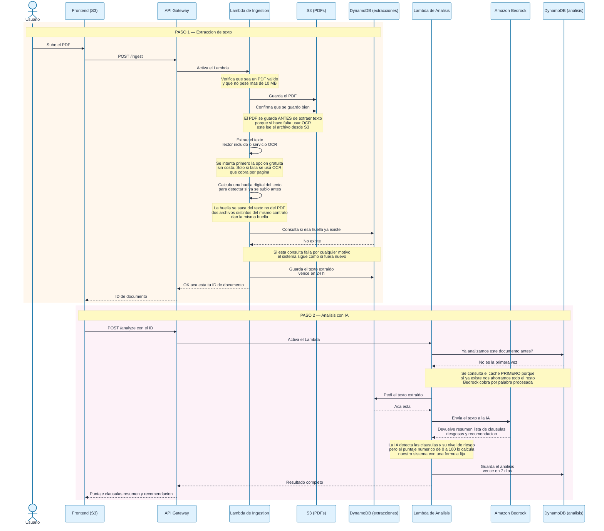
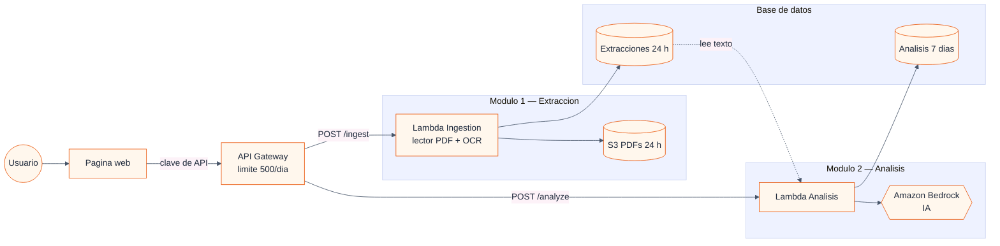

# Arquitectura — Claro y Simple

> Material de referencia para el video del hackathon.
> Generado el 26/07/2026 a partir del código en producción.

---

## Diagrama 1 — Flujo de datos: cómo viaja un contrato desde que se sube hasta que se analiza

El sistema funciona en **dos pasos**: primero se extrae el texto del PDF, y una vez que se tiene el `document_id`, se dispara el análisis con inteligencia artificial. El frontend orquesta ambas llamadas — el usuario solo ve "subir PDF" y "ver resultado".

---

## Diagrama 2 — Componentes del sistema

---

## Decisiones clave que muestra el Diagrama 1

Cada nota del diagrama anterior refleja una decisión de diseño real del sistema:

1. **El PDF se guarda en S3 antes de extraer el texto** porque el servicio de OCR (para PDFs escaneados) no recibe el archivo — necesita la referencia de dónde está guardado.

2. **Se prefiere el lector de PDF incluido sobre el OCR** siempre que sea posible: el primero no tiene costo adicional, el OCR cobra por página procesada. Solo se usa OCR cuando el otro no pudo leer nada.

3. **La huella digital se calcula sobre el texto extraído**, no sobre el archivo PDF original. Dos personas que escanean el mismo contrato en papel producen archivos distintos, pero el texto es igual — y eso permite detectar que es el mismo documento y no analizarlo dos veces.

4. **La detección de duplicados es a prueba de fallos**: si la consulta falla por un error momentáneo, el sistema avanza como si fuera un documento nuevo. Es una optimización de costo, no un requisito indispensable.

5. **El caché se consulta antes de leer el texto y antes de llamar a la IA** porque es el mayor ahorro del sistema: si un documento ya fue analizado, se devuelve el resultado guardado sin gastar ni un centavo en inteligencia artificial.

6. **El puntaje de riesgo (0 a 100) no lo inventa la IA**: lo calcula nuestro sistema con una fórmula fija a partir de la cantidad y gravedad de las cláusulas detectadas. Esto garantiza que el mismo contrato, analizado dos veces, dé siempre el mismo puntaje.
