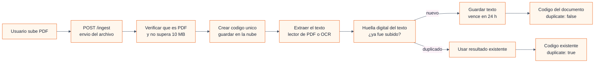
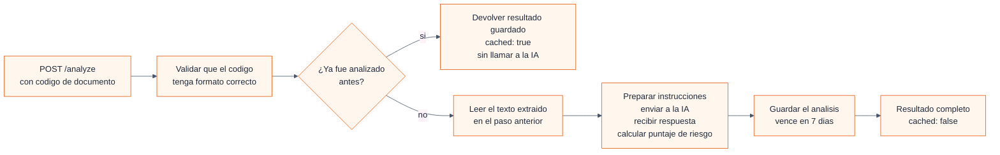

# Casos de uso — Claro y Simple

> Escenarios que el sistema está diseñado para manejar: qué hace en el camino feliz y qué pasa cuando algo sale mal.

---

## Caso de Uso 1 — Subir un contrato (POST /ingest)

**¿Quién lo hace?** La persona que quiere analizar su contrato, a través de la página web.

**¿Qué necesita?** Tener un archivo PDF de hasta 10 MB (la página ya le avisa si el archivo no es PDF o es muy grande, antes de enviarlo).

### Camino feliz — el flujo normal cuando todo sale bien

1. La página envía el PDF a nuestro sistema.
2. El sistema verifica que realmente sea un PDF (mirando los primeros bytes del archivo, no confiando en la extensión) y que pese menos de 10 MB.
3. Genera un código único para este documento (un UUID, algo como `3f6a1b2c-4d5e-4f7a-8b9c-0d1e2f3a4b5c`). Este código siempre lo crea el servidor, nunca viene del cliente — así evitamos que alguien invente uno.
4. Guarda el PDF en la nube (Amazon S3) y confirma que se guardó correctamente.
5. Extrae el texto del PDF. Primero intenta con un software lector de PDFs incluido en el sistema. Si no puede (por ejemplo, porque es un PDF escaneado, una foto de un papel), usa un servicio de OCR que lee el texto de las imágenes.
6. Calcula una huella digital del texto (SHA-256) para saber si ese mismo contrato ya fue subido antes.
7. Consulta si esa huella ya existe en nuestra base de datos. Si existe, devuelve el código del documento original con una marca de "duplicado", y no gasta espacio guardando el mismo texto dos veces.
8. Si es nuevo, guarda el texto en la base de datos (expira automáticamente en 24 horas, por privacidad).
9. Responde con el código del documento y `duplicate: false` (o `true` si ya existía).

### ¿Qué puede fallar? — 10 situaciones de error

Cada una tiene un código de error estándar que la página web reconoce y traduce a un mensaje amigable en español.

---

**Error: `MISSING_FILE` — "No se recibió el archivo" (HTTP 400)**

Puede pasar por tres motivos:
- La solicitud llegó sin el formato correcto (sin el encabezado que indica que trae un archivo).
- Venía el formato pero el campo donde debería estar el PDF está vacío.
- Se recibieron bytes pero están vacíos.

En cualquiera de los tres casos, el sistema no genera código de documento ni toca la base de datos — devuelve el error y el usuario vuelve a intentar.

---

**Error: `INVALID_FILE_TYPE` — "El archivo no es un PDF válido" (HTTP 400)**

Dos controles distintos:
- La parte del mensaje que contiene el archivo declara que no es `application/pdf`.
- Los primeros bytes del archivo no empiezan con `%PDF` (la firma que todo PDF verdadero tiene, sin importar su extensión).

El sistema no persiste nada y le pide al usuario que verifique que sea un documento PDF real.

---

**Error: `FILE_TOO_LARGE` — "El archivo supera los 10 MB" (HTTP 413)**

El archivo pesa más de 10 megabytes. Es el único error de validación que devuelve el código 413 en vez de 400 — el resto de las validaciones usa 400.

---

**Error: `EMPTY_EXTRACTION` — "No se pudo extraer texto" (HTTP 422)**

Ni el lector de PDFs ni el OCR pudieron sacar texto del documento. Esto puede pasar con PDFs que son puramente gráficos sin texto reconocible, o con archivos dañados. Este error es especial: incluye el código del documento en la respuesta, porque el sistema ya había generado uno (y ya había guardado el PDF en la nube, aunque no sirva). Es el único error que devuelve el código de documento — todos los demás lo omiten.

---

**Error: `TEXTRACT_FAILURE` — "El OCR falló" (HTTP 422)**

El servicio de OCR (el que lee PDFs escaneados) tiró un error inesperado. El PDF quedó guardado (se limpia solo en 24 horas), pero no se pudo extraer texto.

---

**Error: `S3_OBJECT_NOT_FOUND` — "El PDF no se encuentra" (HTTP 422)**

El OCR intentó leer el PDF desde la nube, pero el archivo no estaba donde debía estar o no era accesible. Es un error de infraestructura poco frecuente.

---

**Error: `STORAGE_FAILURE` — "No se pudo guardar el archivo" (HTTP 502)**

Falla al guardar el PDF en la nube o al verificar que se guardó correctamente. Es un problema temporal de infraestructura — el usuario debería reintentar en unos minutos.

---

**Error: `PERSISTENCE_FAILURE` — "Error al guardar en la base de datos" (HTTP 502)**

El texto se extrajo correctamente, el PDF está guardado, pero al querer escribir el resultado en la base de datos algo falló (red, permisos, mucha carga). Es el único error que ocurre con la extracción ya exitosa; si el usuario reintenta, el texto se vuelve a extraer (no queda guardado de la vez anterior).

---

**Error: `VALIDATION_FAILURE` — "Error interno de validación" (HTTP 500)**

El texto se extrajo bien, pero al armar el registro para guardarlo, alguno de los datos no pasó las reglas de calidad internas (por ejemplo, el código generado no tiene el formato correcto de UUID). El sistema detecta esto antes de intentar grabar y devuelve el error. Es una situación extremadamente rara.

---

**Error: `INTERNAL_ERROR` — "Error inesperado" (HTTP 500)**

Cualquier cosa que falle y no esté contemplada en los casos anteriores. El sistema registra el error completo para diagnóstico, pero al usuario solo le muestra un mensaje genérico ("Error interno del servidor") sin exponer detalles técnicos.

---

### Caso especial — Contrato duplicado (no es un error)

Si la huella digital del texto coincide con la de un documento que ya estaba en la base de datos, el sistema no crea un registro nuevo. Devuelve HTTP 200 (éxito) con el código del documento original y `duplicate: true`.

**¿Qué gana el usuario con esto?** Cuando la página web mande a analizar ese código, el sistema va a encontrar el análisis que ya se hizo la primera vez y lo va a devolver sin llamar a la inteligencia artificial — ahorrando tiempo y costo.

**¿Y si falla la consulta de duplicados?** El sistema no se detiene. Sigue adelante como si fuera un documento nuevo. La detección de duplicados es una mejora para ahorrar plata, no una función obligatoria.

---

## Caso de Uso 2 — Analizar un contrato (POST /analyze)

**¿Quién lo hace?** La misma persona, inmediatamente después de subir el PDF (la página web encadena automáticamente el paso 1 y el paso 2).

**¿Qué necesita?** Haber completado el Caso de Uso 1 con éxito — tener un código de documento válido.

### Camino feliz — el flujo normal cuando todo sale bien

1. La página envía el código del documento.
2. El sistema verifica que el código tenga el formato correcto de UUID.
3. **Antes de hacer nada costoso**, consulta si ese documento ya fue analizado antes. Si encuentra un análisis previo, lo devuelve directo con una marca de `cached: true` — cero gasto en inteligencia artificial.
4. Si no hay análisis previo, lee el texto que se extrajo en el Caso de Uso 1.
5. Verifica que el texto no sea demasiado largo (más de 150 000 caracteres — un libro entero).
6. Arma una instrucción para la inteligencia artificial: le pide que lea el contrato y devuelva un resumen en lenguaje simple, una lista de cláusulas riesgosas con su explicación, y una recomendación general. Todo en español.
7. Envía esa instrucción a Claude (Amazon Bedrock) y espera la respuesta.
8. La IA devuelve: el resumen, las cláusulas que encontró (cada una con su categoría, nivel de riesgo, explicación y una pregunta sugerida para hacer antes de firmar) y la recomendación general.
9. El sistema calcula el puntaje de riesgo (0 a 100) con una fórmula fija a partir de las cláusulas: cada cláusula de riesgo bajo suma 10 puntos, cada una de riesgo medio suma 25, cada una de riesgo alto suma 45. El máximo posible es 100.
10. Guarda el análisis completo en la base de datos (expira en 7 días).
11. Devuelve todo — puntaje, cláusulas, resumen, recomendación — con `cached: false`.

### ¿Qué puede fallar? — 10 situaciones de error

---

**Error: `MISSING_DOCUMENT_ID` — "Falta el código de documento" (HTTP 400)**

La solicitud no incluye el campo `document_id`, o está vacío. No se toca la base de datos ni se llama a la IA. La página web muestra un mensaje pidiendo que se suba el contrato de nuevo.

---

**Error: `INVALID_DOCUMENT_ID` — "El código no tiene formato válido" (HTTP 400)**

El valor recibido no es un UUID (el formato estándar de 36 caracteres con guiones). Probablemente es un error de tipeo o un enlace mal copiado. La página web pide subir el contrato de nuevo.

---

**Error: `DOCUMENT_NOT_FOUND` — "El documento no existe" (HTTP 404)**

El código tiene formato válido, pero no corresponde a ningún documento en nuestra base de datos. Puede ser que el documento ya haya expirado (los textos se borran a las 24 horas) o que nunca haya sido subido. El sistema le pide al usuario que suba el PDF de nuevo. Este error ocurre **después** de verificar si había un análisis en caché — si el análisis ya se hizo y todavía no expiró, el sistema lo habría devuelto sin llegar a este punto.

---

**Error: `CONTEXT_TOO_LONG` — "El contrato es demasiado extenso" (HTTP 422)**

El texto extraído supera los 150 000 caracteres, que es el máximo que la IA puede procesar en una sola consulta. El sistema lo detecta antes de gastar recursos llamando a la IA. La página web sugiere intentar con un documento más corto.

---

**Error: `MODEL_RESPONSE_INVALID` — "La IA no respondió correctamente" (HTTP 422)**

La IA respondió, pero en un formato que nuestro sistema no puede interpretar (no es JSON válido, o le faltan campos requeridos). **La llamada a la IA sí se hizo** — los recursos se gastaron, pero no se pudo aprovechar la respuesta. Si el usuario reintenta, se vuelve a llamar a la IA desde cero.

---

**Error: `BEDROCK_TIMEOUT` — "La IA tardó demasiado" (HTTP 503)**

La IA no respondió dentro del tiempo máximo configurado (45 segundos). Puede ser un pico de carga en el servicio. El usuario debería reintentar en unos minutos.

---

**Error: `BEDROCK_THROTTLED` — "Demasiadas consultas a la IA" (HTTP 503)**

El servicio de IA rechazó la consulta porque hay demasiadas peticiones simultáneas. El usuario debería esperar unos minutos y reintentar.

---

**Error: `BEDROCK_SERVICE_ERROR` — "El servicio de IA no está disponible" (HTTP 502)**

La IA devolvió un error de servicio no recuperable (no es timeout ni exceso de uso). El usuario debería reintentar más tarde.

---

**Error: `PERSISTENCE_FAILURE` — "No se pudo guardar el análisis" (HTTP 502)**

La IA respondió correctamente, el puntaje se calculó, todo estaba listo para guardarse — pero la escritura en la base de datos falló. **La llamada a la IA ya se hizo y se pagó**, pero el resultado no quedó guardado. Si el usuario reintenta, el sistema **vuelve a llamar a la IA** desde cero (porque no hay nada en caché que reutilizar).

---

**Error: `INTERNAL_ERROR` — "Error inesperado" (HTTP 500)**

Cualquier situación no contemplada en los errores anteriores. El sistema registra los detalles para diagnóstico pero no los expone al usuario.

---

### Caso especial — Resultado en caché (no es un error)

Si el documento ya fue analizado antes y el resultado todavía no expiró (7 días), el sistema lo devuelve directamente con `cached: true`. En este camino:

- No se lee el texto de la base de datos de extracciones.
- No se llama a la inteligencia artificial.
- No se gasta un centavo en Bedrock.

Este es el camino por el que entran automáticamente los contratos duplicados (los que el Caso de Uso 1 detectó con la huella digital). También es el camino que toma un usuario que vuelve a pedir el análisis del mismo documento antes de que pasen 7 días.
